### 1.

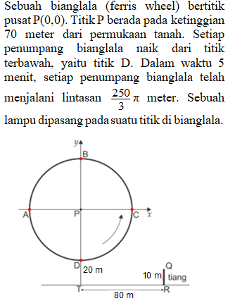

**Soal:** Bianglala berputar satu putaran dalam waktu ... menit.

**Opsi:**

- A. 6
- B. 7
- C. 8
- D. 9
- E. 10

### 2.

**Soal:** Pada suatu saat seseorang berada pada titik B. sembilan menit kemudian, dia berada pada titik yang jaraknya ke garis AC adalah ... meter.

**Opsi:**

- A. 0
- B. 20
- C. 25
- D. 35
- E. 50

### 3.

**Soal:** Misalkan QR adalah tiang dengan tinggi 10 meter. Jarak terjauh antara lampu dan titik Q adalah ... meter.Jawablah soal berikut dengan mengetikkan jawaban berupa angka (bilangan bulat tanpa koma atau titik)!

### Soal Essay
### 4.

**Soal:** Pada saat jarak lampu ke titik Q mencapai nilai terpendek, panjang bayangan tiang QR adalah ... meter.

**Opsi:**

- A.
- B.
- C.
- D.
- E.

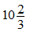

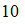

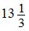

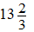

### 5.

**Soal:** Misalkan titik X pada tanah adalah bayangan titik Q oleh lampu ketika bayangan tiang QR paling pendek. Titik Y pada tanah adalah bayangan titik Q ketika bayangan tiang QR paling panjang.  Titik A’ adalah bayangan titik Q di tanah ketika lampu berada di titik A. Ketika lampu berputar mulai dari titik A, urutan posisi bayangan titik Q di tanah adalah

**Opsi:**

- A. A'-X-A'-B'-Y-B'-A'.
- B. A'-B'-X-B'-A'-Y-A'.
- C. A'-Y-A’-B'-X-B’-A'.
- D. A'-B'-V-B'-A'-X-A'.
- E. A'-B'-X-B'-A'-Y-A'.

### 6.

**Question:** Diagram berikut menampilkan data mengenai populasi angkatan kerja di dua kecamatan, yaitu A dan B, pada tahun 2022 berdasarkan status bekerja, menganggur, dan tidak aktif secara ekonomi.Diketahui populasi angkatan kerja di Kecamatan A adalah 20.000 orang, sedangkan di Kecamatan B adalah 15.000 orang.
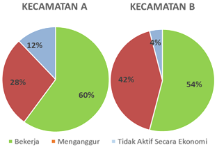

**Soal:** Perbandingan permil angkatan kerja yang bekerja di Kecamatan A dengan yang bekerja atau menganggur dari kedua kecamatan adalah…‰Jawablah soal berikut dengan mengetikkan jawaban berupa angka (bilangan bulat tanpa koma atau titik)!

### Soal Essay
### 7.

**Question:** Diagram berikut menampilkan data mengenai populasi angkatan kerja di dua kecamatan, yaitu A dan B, pada tahun 2022 berdasarkan status bekerja, menganggur, dan tidak aktif secara ekonomi.Diketahui populasi angkatan kerja di Kecamatan A adalah 20.000 orang, sedangkan di Kecamatan B adalah 15.000 orang.

**Soal:** Dari semua angkatan kerja yang tidak aktif secara ekonomi di kedua kecamatan, persentase yang tinggal di Kecamatan B adalah ... %.Jawablah soal berikut dengan mengetikkan jawaban hanya berupa angka (bilangan bulat tanpa koma atau titik)!

### Soal Essay
### 8.

**Question:** Diagram berikut menampilkan data mengenai populasi angkatan kerja di dua kecamatan, yaitu A dan B, pada tahun 2022 berdasarkan status bekerja, menganggur, dan tidak aktif secara ekonomi.Diketahui populasi angkatan kerja di Kecamatan A adalah 20.000 orang, sedangkan di Kecamatan B adalah 15.000 orang.

**Soal:** Jika seseorang dipilih secara acak dari kedua kecamatan, peluang orang yang terpilih bekerja atau menganggur adalah

**Opsi:**

- A.
- B.
- C.
- D.
- E.

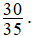

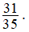

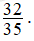

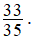

### 9.

**Question:** Diagram berikut menampilkan data mengenai populasi angkatan kerja di dua kecamatan, yaitu A dan B, pada tahun 2022 berdasarkan status bekerja, menganggur, dan tidak aktif secara ekonomi.Diketahui populasi angkatan kerja di Kecamatan A adalah 20.000 orang, sedangkan di Kecamatan B adalah 15.000 orang.

**Soal:** Jika pada tahun 2023 terjadi kenaikan jumlah orang yang bekerja di Kecamatan A sebanyak 20% dari tahun sebelumnya, dengan asumsi populasi angkatan kerja dan orang yang tidak aktif secara ekonomi tetap, maka persentase pengangguran di Kecamatan A berkurang ... % dari jumlah pengangguran sebelumnya di kecamatan A.

**Opsi:**

- A. 10
- B. 11
- C. 42,85
- D. 43,55
- E. 45,50

### 10.

**Question:** Dalam suatu kelas terdapat 15 murid laki-laki dan 18 murid perempuan. Rata-rata nilai ulangan Matematika di kelas tersebut adalah 83. Setelah melihat hasil tersebut, guru Matematika memberikan kesempatan kepada 3 murid, dengan nilai masing-masing 52, 57, dan 62 untuk melakukan remedial. Diketahui bahwa nilai rata-rata peserta remedial naik 11 poin.
**Soal:** Jika sebelum remedial, rata-rata nilai ulangan murid laki-laki di kelas tersebut adalah 77 maka rata-rata nilai ulangan murid perempuan adalah

**Opsi:**

- A. 87,5.
- B. 88.
- C. 88,5.
- D. 89
- E. 90.

### 11.

**Question:** Dalam suatu kelas terdapat 15 murid laki-laki dan 18 murid perempuan. Rata-rata nilai ulangan Matematika di kelas tersebut adalah 83. Setelah melihat hasil tersebut, guru Matematika memberikan kesempatan kepada 3 murid, dengan nilai masing-masing 52, 57, dan 62 untuk melakukan remedial. Diketahui bahwa nilai rata-rata peserta remedial naik 11 poin.
**Soal:** Diberikan pernyataan berikut!(1)   Rata-rata nilai kelas tanpa memperhitungkan ketiga murid yang mengikuti remedial adalah 85,6.(2)   Sebelum remedial, rata-rata nilai ulangan yang mengikuti remedial adalah 58.(3)   Setelah remedial, rata-rata nilai ulangan seluruh murid menjadi 84.(4)   Jangkauan data nilai tiga murid sebelum mengikuti remedial adalah 11.Pernyataan di atas yang benar adalah

**Opsi:**

- A. 1, 2, dan 3.
- B. 1 dan 3.
- C. 2 dan 4.
- D. 4.
- E. 1, 2, 3, dan 4.

### 12.

**Question:** Dalam suatu kelas terdapat 15 murid laki-laki dan 18 murid perempuan. Rata-rata nilai ulangan Matematika di kelas tersebut adalah 83. Setelah melihat hasil tersebut, guru Matematika memberikan kesempatan kepada 3 murid, dengan nilai masing-masing 52, 57, dan 62 untuk melakukan remedial. Diketahui bahwa nilai rata-rata peserta remedial naik 11 poin.
**Soal:** Akan dipilih pengurus inti kelas yang terdiri dari 4 murid. Peluang kelas memiliki dua atau tiga murid laki-laki sebagai anggota pengurus inti adalah

**Opsi:**

- A.
- B.
- C.
- D.
- E.

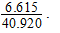

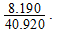

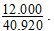

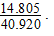

### 13.

**Question:** Kambing ditempatkan dalam kandang pada suatu halaman penuh rumput. Kandang berbentuk persegi panjang PQRS dengan panjang PQ = 16 meter dan lebar QR = 12 meter. Kambing ditempatkan pada dinding PQ dengan tali yang panjangnya a meter. Pangkal tali ditambatkan pada dinding PQ di titik K berjarak x meter dari titik sudut P.
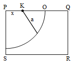

**Soal:** Jika diketahui bahwa 0 < a < 8 meter, daerah merumput kambing akan maksimal jika

**Opsi:**

- A.
- B.
- C.
- D.
- E.

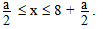

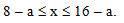

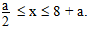

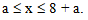

### 14.

**Question:** Kambing ditempatkan dalam kandang pada suatu halaman penuh rumput. Kandang berbentuk persegi panjang PQRS dengan panjang PQ = 16 meter dan lebar QR = 12 meter. Kambing ditempatkan pada dinding PQ dengan tali yang panjangnya a meter. Pangkal tali ditambatkan pada dinding PQ di titik K berjarak x meter dari titik sudut P.

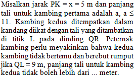

**Opsi:**

- A.
- B.
- C.
- D.
- E.

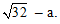

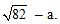

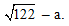

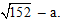

### 15.

**Question:** Kambing ditempatkan dalam kandang pada suatu halaman penuh rumput. Kandang berbentuk persegi panjang PQRS dengan panjang PQ = 16 meter dan lebar QR = 12 meter. Kambing ditempatkan pada dinding PQ dengan tali yang panjangnya a meter. Pangkal tali ditambatkan pada dinding PQ di titik K berjarak x meter dari titik sudut P.

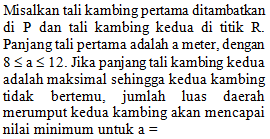

**Opsi:**

- A. 7.
- B. 8.
- C. 9.
- D. 10.
- E. 12.

### 16.

**Question:** Berikut ini adalah tabel klasmen sementara lima klub teratas di LaLiga Spanyol tahun 2023/2024. Setiap klub melakukan tepat dua pertandingan dengan setiap tim lain dimana terdapat 20 klub yang bermain di LaLiga Spanyol. Poin yang diberikan di bawah ini adalah setelah klub memainkan sekitar tiga puluh pertandingan.Untuk setiap kemenangan, klub akan mendapatkan 3 poin, imbang 1 poin, dan kalah 0 poin.
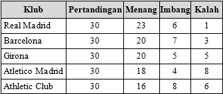

**Soal:** Total banyaknya pertandingan di LaLiga Spanyol adalah ... pertandingan.

**Opsi:**

- A. 190
- B. 200
- C. 380
- D. 400
- E. 760

### 17.

**Question:** Berikut ini adalah tabel klasmen sementara lima klub teratas di LaLiga Spanyol tahun 2023/2024. Setiap klub melakukan tepat dua pertandingan dengan setiap tim lain dimana terdapat 20 klub yang bermain di LaLiga Spanyol. Poin yang diberikan di bawah ini adalah setelah klub memainkan sekitar tiga puluh pertandingan.Untuk setiap kemenangan, klub akan mendapatkan 3 poin, imbang 1 poin, dan kalah 0 poin.

**Soal:** Poin minimal yang harus diperoleh Real Madrid dipertandingan tersisa untuk menjamin tim ini sebagai juara LaLiga Spanyol 2023/2024 adalah

**Opsi:**

- A. 14.
- B. 15.
- C. 16.
- D. 17.
- E. 18.

### 18.

**Question:** Berikut ini adalah tabel klasmen sementara lima klub teratas di LaLiga Spanyol tahun 2023/2024. Setiap klub melakukan tepat dua pertandingan dengan setiap tim lain dimana terdapat 20 klub yang bermain di LaLiga Spanyol. Poin yang diberikan di bawah ini adalah setelah klub memainkan sekitar tiga puluh pertandingan.Untuk setiap kemenangan, klub akan mendapatkan 3 poin, imbang 1 poin, dan kalah 0 poin.

**Soal:** Jika di pertandingan tersisa Barcelona memenangkan dua pertandingan dan sisanya imbang, kemungkinan komposisi menang-imbang-kalah untuk girona pada pertandingan sisa untuk menjamin bahwa Girona menempati posisi kedua pada klasmen akhir adalah(1)   5-2-1                 (2)   6-0-2 (3)   5-3-0(4)   4-4-0

**Opsi:**

- A. 1, 2, 3 benar.
- B. 1, 3 benar.
- C. 2, 4 benar.
- D. 4 saja benar.
- E. semua benar.

