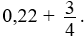
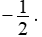

### 1.

**Soal:** Dari data berikut yang berupa bilangan asli: p, 3, q, 6, r, 9Diketahui bahwa data tidak mempunyai modus.Nilai q × r yang tidak mungkin adalah

- A. 21
- B. 28
- C. 32
- D. 35
- E. 54

### 2.

**Soal:** Supaya kedua garis f(x) = 3x + 2 dan g(x) = ax + 4 saling berpotongan, maka nilai a = (1)   1(2)   2(3)   3(4)   4Banyak pernyataan yang benar ada

- A. 0.
- B. 1.
- C. 2.
- D. 3.
- E. 4.

### 3.

- A. P > Q
- B. P < Q
- C. P = Q
- D. Tidak dapat ditentukan hubungan P dan Q.

### 4.

**Soal:** Untuk membuat secangkir kopi dibutuhkan 2 sendok kopi dan 3 sendok gula. Untuk membuat 5 cangkir kopi dibutuhkan a sendok kopi dan b sendok gula. Manakah hubungan yang benar antara kuantitas P dan Q berikut berdasarkan informasi yang diberikan.

- A. P > Q.
- B. P < Q.
- C. P = Q.
- D. Tidak dapat ditentukan hubungan P dan Q.

### 5.

**Soal:** Perhatikan gambar berikut!Besar sudut PQR adalah

- A. 105°.
- B. 110°.
- C. 120°.
- D. 135°.
- E. 150°.

### 6.

**Soal:** Perhatikan gambar berikut!Jika PQ = PTMaka luas jajar genjang RQTS adalah

- A. 
- B. 
- C. 
- D. 
- E. 

### 7.

**Soal:** Diketahui: -1, a, -4, b merupakan suatu barisan geometri. Maka nilai a.b adalah

- A. -16.
- B. -4.
- C. 4.
- D. 16.
- E. 32.

### 8.

- A. 
- B. 
- C. 
- D. 
- E. 

### 9.

- A. -2.
- B. -1.
- C. 0
- D. 1.
- E. 2.

### 10.

**Soal:** Jika Un adalah suku ke-n barisan aritmetika dan U7 + U3 = 3U9 maka U3 : U12 adalah

- A. 14 : 5.
- B. 12 : 7.
- C. 5 : 12.
- D. 7 : 12.
- E. 11 : 12.

### 11.

- A. 
- B. 
- C. 1.
- D. 2.
- E. 8.

### 12.

**Soal:** Faktor persekutuan terbesar setiap dua bilangan diantara bilangan asli a, b, c adalah 1. Jika a2 b = 20 dan b - a = c maka nilai a + b + c yang mungkin adalah(1)   10(2)   12(3)   40(4)   41

- A. 1, 2, dan 3 benar.
- B. 1 dan 3 benar.
- C. 2 dan 4 benar.
- D. 4 saja yang benar.
- E. semua benar.

### 13.

- A. (-1, 5).
- B. (1, 3).
- C. (1, 5).
- D. 
- E. 

### 14.

**Soal:** Dari angka 1, 2, 3, 4, 5, 7 akan disusun bilangan ganjil terdiri dari 6 digit berbeda. Banyak bilangan terbentuk yang kurang dari 400.000 adalah

- A. 120.
- B. 144.
- C. 192.
- D. 240.
- E. 720.

### 15.

**Soal:** Dari operasi # pada himpunan bilangan bulat diperoleh 2 # (1 # 3) = 2, maka operasi p # q dapat didefinisikan oleh

- A. p(q + p - 1).
- B. (p + q) p - 8.
- C. (q + 4) - p.
- D. 4 - (q + 4) p.
- E. q(q - p + 1).

### 16.

**Soal:** Dari data berikut yang berupa bilangan asli: p, 3, q, 6, r, 9.Diketahui bahwa data tidak  mempunyai modus. Nilai p + q yang mungkin adalah

- A. 4
- B. 5
- C. 8
- D. 10
- E. 11

### 17.

**Soal:** Perhatikan fungsi berikut! f(x) = 4(x - 1)2 - 2 dan g(x) = -4x + 1. Absis titik potong f(x) dan g(x) adalah

- A. -1.
- B. 
- C. 
- D. 1.
- E. 2.

### 18.

**Soal:** Pada kubus ABCD.EFGH dengan panjang rusuk 10 cm. Jika titik P terletak pada perpanjangan rusuk CG, CG : CP = 2 : 3 maka jarak titik A ke titik P adalah ... cm.

- A. 
- B. 
- C. 
- D. 
- E. 

### 19.

### Soal Essay
