### 1.

**Question:** Ruangan yang alasnya berbentuk persegi panjang. Dinding sebelah kiri dan kanan pada bagian bawah akan dipasang keramik. Keramik yang dipakai tidak ada yang di potong berukuran 30 cm x 30 cm terdiri dari warna putih dan warna biru, seperti tampak pada gambar. Dinding sebelah kiri terdapat tiga jendel yang jarak jendela ke dinding 1 m dan lebar satu jendela antara 1 m sampai  2 meter

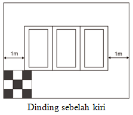

**Soal:** Panjang ruangan minimal sebelah kanan maupun sebelah kiri adalah ... cm.

- A. 360
- B. 420
- C. 480
- D. 510
- E. 600

### 2.

**Question:** Ruangan yang alasnya berbentuk persegi panjang. Dinding sebelah kiri dan kanan pada bagian bawah akan dipasang keramik. Keramik yang dipakai tidak ada yang di potong berukuran 30 cm x 30 cm terdiri dari warna putih dan warna biru, seperti tampak pada gambar. Dinding sebelah kiri terdapat tiga jendel yang jarak jendela ke dinding 1 m dan lebar satu jendela antara 1 m sampai  2 meter

**Soal:** Luas minimal daerah yang dipasang keramik adalah

- A. 9 m2.
- B. 9,18 m2.
- C. 10 m2.
- D. 10,8 m2.
- E. 11 m2.

### 3.

**Question:** Ruangan yang alasnya berbentuk persegi panjang. Dinding sebelah kiri dan kanan pada bagian bawah akan dipasang keramik. Keramik yang dipakai tidak ada yang di potong berukuran 30 cm x 30 cm terdiri dari warna putih dan warna biru, seperti tampak pada gambar. Dinding sebelah kiri terdapat tiga jendel yang jarak jendela ke dinding 1 m dan lebar satu jendela antara 1 m sampai  2 meter

**Soal:** Untuk memasang keramik dibutuhkan keramik minimal ... buah

- A. 100
- B. 102
- C. 120
- D. 125
- E. 130

### 4.

**Question:** Ruangan yang alasnya berbentuk persegi panjang. Dinding sebelah kiri dan kanan pada bagian bawah akan dipasang keramik. Keramik yang dipakai tidak ada yang di potong berukuran 30 cm x 30 cm terdiri dari warna putih dan warna biru, seperti tampak pada gambar. Dinding sebelah kiri terdapat tiga jendel yang jarak jendela ke dinding 1 m dan lebar satu jendela antara 1 m sampai  2 meter

**Soal:** Banyaknya keramik biru yang dibutuhkan adalah

- A. 35.
- B. 41.
- C. 52.
- D. 65.
- E. 75

### 5.

**Question:** Ada 100 bola berwarna putih diletakan berderet. Bola yang berada pada urutan kelipatan empat diberi warna merah, bola yang berada pada urutan kelipatan tiga diberi warna biru namun yang sudah diberi warna merah dilewat, dan yang berada pada urutan kelipatan lima diberi warna kuning namun yang sudah diberi warna merah dan biru dilewat.

**Soal:** Banyaknya bola yang berwarna merah adalah

- A. 13.
- B. 16.
- C. 20.
- D. 21.
- E. 25.

### 6.

**Question:** Ada 100 bola berwarna putih diletakan berderet. Bola yang berada pada urutan kelipatan empat diberi warna merah, bola yang berada pada urutan kelipatan tiga diberi warna biru namun yang sudah diberi warna merah dilewat, dan yang berada pada urutan kelipatan lima diberi warna kuning namun yang sudah diberi warna merah dan biru dilewat.

**Soal:** Banyaknya bola yang berwarna biru adalah

- A. 15.
- B. 20.
- C. 25.
- D. 32.
- E. 34.

### 7.

**Question:** Ada 100 bola berwarna putih diletakan berderet. Bola yang berada pada urutan kelipatan empat diberi warna merah, bola yang berada pada urutan kelipatan tiga diberi warna biru namun yang sudah diberi warna merah dilewat, dan yang berada pada urutan kelipatan lima diberi warna kuning namun yang sudah diberi warna merah dan biru dilewat.

**Soal:** Banyaknya bola yang berwarna kuning adalah

- A. 4.
- B. 10.
- C. 16.
- D. 20.
- E. 26.

### 8.

**Question:** Ada 100 bola berwarna putih diletakan berderet. Bola yang berada pada urutan kelipatan empat diberi warna merah, bola yang berada pada urutan kelipatan tiga diberi warna biru namun yang sudah diberi warna merah dilewat, dan yang berada pada urutan kelipatan lima diberi warna kuning namun yang sudah diberi warna merah dan biru dilewat.

**Soal:** Banyaknya bola yang berwarna putih yang adalah

- A. 20.
- B. 30.
- C. 40.
- D. 50.
- E. 60.

### 9.

**Question:** Dua tangki air berbentuk kerucut terbalik,  masing-masing diisi air dengan laju pengisian dan waktu awal pengisian yang sama saat kondisi tangki masih kosong. seperti gambar berikut dengan (ukuran pada gambar dalam satuan meter).

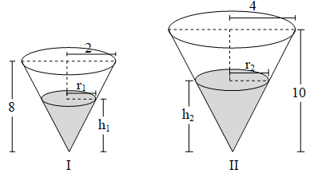

**Soal:** Perbandingan r1 dan r2 adalah

- A. 
- B. 
- C. 
- D. 
- E. 

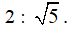
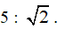
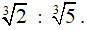
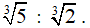
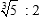
### 10.

**Question:** Dua tangki air berbentuk kerucut terbalik,  masing-masing diisi air dengan laju pengisian dan waktu awal pengisian yang sama saat kondisi tangki masih kosong. seperti gambar berikut dengan (ukuran pada gambar dalam satuan meter).

**Soal:** Perbandingan h1 dengan h2 adalah

- A. 
- B. 
- C. 
- D. 
- E. 

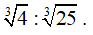
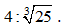
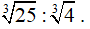
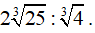
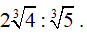
### 11.

**Question:** Dua tangki air berbentuk kerucut terbalik,  masing-masing diisi air dengan laju pengisian dan waktu awal pengisian yang sama saat kondisi tangki masih kosong. seperti gambar berikut dengan (ukuran pada gambar dalam satuan meter).

**Soal:** Misal p adalah sisa tinggi tangki II ketika tangki I sudah penuh. Nilai p adalah ... meter.

- A. 
- B. 
- C. 
- D. 
- E. 

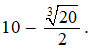
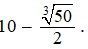
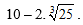
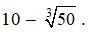
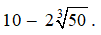
### 12.

**Question:** Toko M menjual minuman xyz dengan  1 botol ukuran besar dan 2 botol ukuran sedang seharga Rp44.000,00, sedangkan 1 botol ukuran besar dan 2 botol ukuran kecil dijual Rp36.000,00. Pada saat Toko M memberi potongan harga Rp1.000,00 untuk botol ukuran besar dan sedang, Alwi membayar Rp81.000,00 untuk 3 botol ukuran besar, 2 botol ukuran sedang, dan 1 botol ukuran kecil.

**Soal:** Jumlah harga 1 botol ukuran besar, 1 botol ukuran sedang, dan 1 botol ukuran kecil adalah

- A. Rp35.000,00.
- B. Rp40.000,00.
- C. Rp45.000,00.
- D. Rp50.000,00.
- E. Rp55.000,00.

### 13.

**Question:** Toko M menjual minuman xyz dengan  1 botol ukuran besar dan 2 botol ukuran sedang seharga Rp44.000,00, sedangkan 1 botol ukuran besar dan 2 botol ukuran kecil dijual Rp36.000,00. Pada saat Toko M memberi potongan harga Rp1.000,00 untuk botol ukuran besar dan sedang, Alwi membayar Rp81.000,00 untuk 3 botol ukuran besar, 2 botol ukuran sedang, dan 1 botol ukuran kecil.

**Soal:** Harga 1 botol ukuran besar sebelum potongan harga adalah

- A. Rp13.000,00.
- B. Rp14.000,00.
- C. Rp15.000,00.
- D. Rp16.000,00.
- E. Rp17.000,00.

### 14.

**Question:** Toko M menjual minuman xyz dengan  1 botol ukuran besar dan 2 botol ukuran sedang seharga Rp44.000,00, sedangkan 1 botol ukuran besar dan 2 botol ukuran kecil dijual Rp36.000,00. Pada saat Toko M memberi potongan harga Rp1.000,00 untuk botol ukuran besar dan sedang, Alwi membayar Rp81.000,00 untuk 3 botol ukuran besar, 2 botol ukuran sedang, dan 1 botol ukuran kecil.

**Soal:** Lala memiliki uang Rp38.500,00 rupiah  dan  pada saat toko M memberikan potongan harga. Agar sisa uangnya sekecil mungkin maka lala harus membeli

- A. 1 botol ukuran besar, 1 botol ukuran sedang, 1 botol ukuran kecil.
- B. 1 botol ukuran besar dan 2 botol ukuran kecil.
- C. 1 botol ukuran besar, 1 botol ukuran sedang, 2 botol ukuran kecil.
- D. 1 botol ukuran sedang dan 2 botol ukuran kecil.
- E. 2 botol ukuran besar dan 1 botol ukuran sedang.

### 15.

**Question:** Data berikut merupakan banyaknya siswa yang memakai kaca mata di lima sekolah.

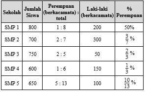

**Soal:** Selisih laki-laki dan perempuan yang berkacamata

- A. 25
- B. 50.
- C. 75.
- D. 100.
- E. 150.

### 16.

**Question:** Data berikut merupakan banyaknya siswa yang memakai kaca mata di lima sekolah.

**Soal:** Perempuan berkacamata yang paling banyak di sekolah?

- A. SMP 1.
- B. SMP 2
- C. SMP 3
- D. SMP 3
- E. SMP 5.

### 17.

**Question:** Data berikut merupakan banyaknya siswa yang memakai kaca mata di lima sekolah.

**Soal:** Pernyataan yang benar adalah(1)   Jumlah laki-laki di SMP 1 lebih banyak dari jumlah perempuan di SMP 4.(2)   Selisih laki-laki yang berkacamata di SMP 2 dan SMP 3 adalah 250 orang.(3)   Perbandingan siswa laki-laki dan perempuan di SMP 2 adalah 4 : 3.(4)   Perbandingan siswa laki-laki berkacamata  dengan perempuan berkacamata di SMP 5 adalah 3 : 5.

- A. (1), (2), dan (3).
- B. (1) dan (3).
- C. (2) dan (4).
- D. (4) saja.
- E. semua benar.

### 18.

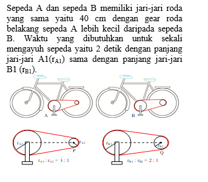

**Soal:** Pada saat satu kayuhan maka perbandingan kecepatan sepeda A dengan sepeda B adalah

- A. 3 : 1.
- B. 2 : 1.
- C. 3 : 2.
- D. 3 : 4
- E. 1 : 3.

### 19.

**Soal:** Kedua sepeda berangkat pada waktu dan tempat secara bersamaan. Selisih jarak lintasan setelah 20 detik adalah

- A. 
- B. 
- C. 
- D. 
- E. 

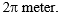
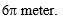
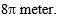
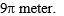
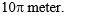
### 20.

**Soal:** Jika sepeda A dikayuh selama 14 detik, maka gear A2 telah berputar sebanyak ... kali.

- A. 15
- B. 18
- C. 21
- D. 24
- E. 27

