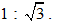
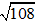

### 1.

**Question:** Berikut beberapa posisi titik di suatu tempat yang dihubungkan oleh beberapa ruas jalan dengan panjang sama dan saling tegak lurus. Panjang ruas jalan AB adalah 12 km.

**Soal:** Pak Wahyu berangkat dari titik A pukul 07.00 dan sampai di titik C pukul 08.30 tanpa melalui E ataupun F namun harus melalui D dengan lintasan terpendek. Kecepatan rata-rata Pak Wahyu adalah

- A. 10 km/jam.
- B. 12 km/jam.
- C. 16 km/jam.
- D. 26 km/jam.
- E. 24 km/jam.

### 2.

**Question:** Berikut beberapa posisi titik di suatu tempat yang dihubungkan oleh beberapa ruas jalan dengan panjang sama dan saling tegak lurus. Panjang ruas jalan AB adalah 12 km.

**Soal:** Dari titik A melewati B dan C tanpa melewati persimpangan yang sama kembali ke A. Luas daerah terkecil yang dibentuk oleh lintasan tersebut adalah

- A. 
- B. 
- C. 
- D. 
- E. 

### 3.

**Question:** Berikut beberapa posisi titik di suatu tempat yang dihubungkan oleh beberapa ruas jalan dengan panjang sama dan saling tegak lurus. Panjang ruas jalan AB adalah 12 km.

**Soal:** Jika akan dipasang pipa lurus di bawah tanah dari B ke F, maka panjang pipa yang dibutuhkan adalah

- A. 11 km.
- B. 12 km.
- C. 15 km.
- D. 25 km
- E. 27 km.

### 4.

**Question:** Andi dan Bobi berada pada dua lintasan sejajar dengan dinding seperti pada gambar. Jarak lintasan keduanya adalah 1 m.Sebuah lampu berjarak 1 m ke lintasan Bobi dan 2 m ke lintasan Andi. Lampu tersebut menyinari mereka sehingga bayangan Andi dan Bobi pada dinding 10 m.Jarak Andi dari titik Q adalah 2 m.

**Soal:** Jarak Andi ke dinding adalah

- A. 6 m.
- B. 7 m.
- C. 8 m.
- D. 9 m.
- E. 10 m.

### 5.

**Question:** Andi dan Bobi berada pada dua lintasan sejajar dengan dinding seperti pada gambar. Jarak lintasan keduanya adalah 1 m.Sebuah lampu berjarak 1 m ke lintasan Bobi dan 2 m ke lintasan Andi. Lampu tersebut menyinari mereka sehingga bayangan Andi dan Bobi pada dinding 10 m.Jarak Andi dari titik Q adalah 2 m.

**Soal:** Jarak Andi ke titik P adalah

- A. 
- B. 
- C. 
- D. 
- E. 

### 6.

**Question:** Pada bulan Agustus Feri dan Rudi memanen hasil ternak ikannya. Feri memanen 150 ekor ikan lele dan 75 ekor ikan gurame dengan berat total 60 kg. Rudi memanen 75 ikan gurame dan 150 ikan nila dengan berat total 75 kg. setiap ikan dari jenis yang sama diasumsikan memiliki berat yang sama.

**Soal:** Satu bulan kemudian, Feri kembali memanen 150 ekor ikan lele dan 75 ekor ikan gurame dengan berat total 67,5 kg. Sedangkan Rudi memanen 75 ikan gurame dan 150 ikan nila dengan berat total 82,5 kg. Jika diasumsikan berat setiap ikan gurame sama dengan berat pada saat panen bulan Agustus, total kenaikan berat sekor ikan lele dan ikan nila adalah ... gr.

- A. 50
- B. 100
- C. 150
- D. 200
- E. 250

### 7.

**Question:** Pada bulan Agustus Feri dan Rudi memanen hasil ternak ikannya. Feri memanen 150 ekor ikan lele dan 75 ekor ikan gurame dengan berat total 60 kg. Rudi memanen 75 ikan gurame dan 150 ikan nila dengan berat total 75 kg. setiap ikan dari jenis yang sama diasumsikan memiliki berat yang sama.

**Soal:** Pada saat Feri dan  Rudi memanen ikan di bulan Agustus, Soni juga menjual 300 ekor ikan lele dan 200 ekor ikan nila dengan berat total 70 kg. Jika harga 1 kg ikan lele Rp20.000,00 dan 1 kg ikan nila Rp27.500,00. Uang  yang didapatkan Soni adalah

- A. Rp1.500.000,00.
- B. Rp1.600.000,00.
- C. Rp1.700.000,00.
- D. Rp1.800.000,00.
- E. Rp1.900.000,00.

### 8.

**Question:** Pada bulan Agustus Feri dan Rudi memanen hasil ternak ikannya. Feri memanen 150 ekor ikan lele dan 75 ekor ikan gurame dengan berat total 60 kg. Rudi memanen 75 ikan gurame dan 150 ikan nila dengan berat total 75 kg. setiap ikan dari jenis yang sama diasumsikan memiliki berat yang sama.

**Soal:** Berat total seekor ikan lele, gurame, dan nila yang dipanen pada bulan Agustus adalah ... gr.

- A. 600
- B. 700
- C. 800
- D. 900
- E. 100

### 9.

**Question:** Petugas pengiriman minyak goreng, mengirim 10 liter minyak ke toko A setiap 3 hari, 5 liter minyak ke toko B setiap 4 hari, dan 15 liter ke toko C setiap x hari. Pada tanggal 1 April 2023 petugas pertama kali mengirim bersamaan ke semua toko dan setelah 60 hari petugas tersebut kembali mengirimkan minyak goreng ke semua toko tersebut.

**Soal:** Nilai 2x terkecil yang memenuhi adalah

- A. 6.
- B. 7.
- C. 8.
- D. 9.
- E. 10.

### 10.

**Question:** Petugas pengiriman minyak goreng, mengirim 10 liter minyak ke toko A setiap 3 hari, 5 liter minyak ke toko B setiap 4 hari, dan 15 liter ke toko C setiap x hari. Pada tanggal 1 April 2023 petugas pertama kali mengirim bersamaan ke semua toko dan setelah 60 hari petugas tersebut kembali mengirimkan minyak goreng ke semua toko tersebut.

**Soal:** Mulai tanggal 1 Mei 2023 pengiriman ke toko A menjadi 15 liter, maka selisih pengiriman minyak selama bulan April dan Mei 2023 adalah ... liter.

- A. 45
- B. 50
- C. 55
- D. 60
- E. 65

### 11.

**Question:** Petugas pengiriman minyak goreng, mengirim 10 liter minyak ke toko A setiap 3 hari, 5 liter minyak ke toko B setiap 4 hari, dan 15 liter ke toko C setiap x hari. Pada tanggal 1 April 2023 petugas pertama kali mengirim bersamaan ke semua toko dan setelah 60 hari petugas tersebut kembali mengirimkan minyak goreng ke semua toko tersebut.

**Soal:** Petugas pengiriman minyak goreng  ke toko A dan ke toko C secara bersamaan untuk ketiga kalinya paling cepat pada tanggal

- A. 25 April 2023.
- B. 28 April 2023.
- C. 30 April 2023.
- D. 1 Mei 2023.
- E. 2 Mei 2023.

### 12.

**Question:** Petugas pengiriman minyak goreng, mengirim 10 liter minyak ke toko A setiap 3 hari, 5 liter minyak ke toko B setiap 4 hari, dan 15 liter ke toko C setiap x hari. Pada tanggal 1 April 2023 petugas pertama kali mengirim bersamaan ke semua toko dan setelah 60 hari petugas tersebut kembali mengirimkan minyak goreng ke semua toko tersebut.

**Soal:** Petugas pengiriman minyak goreng, dari tanggal 1 sampai 15 April 2023 telah mengirim minyak goreng  ke toko A, toko B dan ke toko C sebanyak ... liter.

- A. 100
- B. 115
- C. 120
- D. 125
- E. 130

### 13.

**Question:** Banyak karyawan dari 5 perusahaan yang terdata pada program asuransi dapat disajikan dalam tabel berikut.

**Soal:** Selisih jumlah karyawan laki-laki dan perempuan peserta Asuransi  adalah ... orang.

- A. 28
- B. 31
- C. 32
- D. 40
- E. 46

### 14.

**Question:** Banyak karyawan dari 5 perusahaan yang terdata pada program asuransi dapat disajikan dalam tabel berikut.

**Soal:** Perusahaan yang memiliki selisih jumlah laki-laki dan perempuan yang tidak mengikuti Asuransi lebih dari 14 orang adalah

- A. perusahaan P  dan perusahaan Q.
- B. perusahaan Q  dan perusahaan R.
- C. perusahaan R  dan perusahaan S.
- D. perusahaan S  dan perusahaan T.
- E. perusahaan T  dan perusahaan P.

### 15.

**Question:** Banyak karyawan dari 5 perusahaan yang terdata pada program asuransi dapat disajikan dalam tabel berikut.

**Soal:** Jumlah karyawan laki-laki peserta Asuransi  terbanyak di perusahaan

- A. P.
- B. Q.
- C. R.
- D. S.
- E. T.

### 16.

**Question:** Dua jenis pasir, yaitu pasir  jenis A dan jenis B dituangkan bersama-sama secara terpisah sehingga membentuk kerucut. Radius kerucut pasir A selalu sama dengan tingginya sedangkan radius kerucut pasir B dua kali tingginya. P1 dan P2 berturut-turut adalah pusat alas tumpukan pasir A dan pasir B. Jarak antara P1 dan P2 adalah 10 cm.

**Soal:** Jika pasir tersebut dituangkan dengan debit volume yang sama maka perbandingan jari-jari kerucut pasir jenis A  dengan jari-jari kerucut pasir jenis B   adalah

- A. 
- B. 
- C. 
- D. 
- E. 

### 17.

**Question:** Dua jenis pasir, yaitu pasir  jenis A dan jenis B dituangkan bersama-sama secara terpisah sehingga membentuk kerucut. Radius kerucut pasir A selalu sama dengan tingginya sedangkan radius kerucut pasir B dua kali tingginya. P1 dan P2 berturut-turut adalah pusat alas tumpukan pasir A dan pasir B. Jarak antara P1 dan P2 adalah 10 cm.

**Soal:** Jika pasir tersebut dituangkan debit volume yang sama maka perbandingan tinggi kerucut pasir jenis A  dengan tinggi kerucut pasir jenis B   adalah

- A. 
- B. 
- C. 
- D. 
- E. 

### 18.

**Question:** Dua jenis pasir, yaitu pasir  jenis A dan jenis B dituangkan bersama-sama secara terpisah sehingga membentuk kerucut. Radius kerucut pasir A selalu sama dengan tingginya sedangkan radius kerucut pasir B dua kali tingginya. P1 dan P2 berturut-turut adalah pusat alas tumpukan pasir A dan pasir B. Jarak antara P1 dan P2 adalah 10 cm.

**Soal:** Kedua pasir terus dituangkan dengan debit volume yang sama sehingga kedua dasarnya bertemu (bersinggungan) di titik Z. Jarak titik Z ke P1 adalah

- A. 
- B. 
- C. 
- D. 
- E. 

### 19.

**Question:** Dua jenis pasir, yaitu pasir  jenis A dan jenis B dituangkan bersama-sama secara terpisah sehingga membentuk kerucut. Radius kerucut pasir A selalu sama dengan tingginya sedangkan radius kerucut pasir B dua kali tingginya. P1 dan P2 berturut-turut adalah pusat alas tumpukan pasir A dan pasir B. Jarak antara P1 dan P2 adalah 10 cm.

**Soal:** Jika pasir tersebut dituangkan debit volume yang sama. Apabila hB = 2 m, jarak antara kedua puncak tumpukan pasir adalah ... m.

- A. 
- B. 
- C. 
- D. 
- E. 

