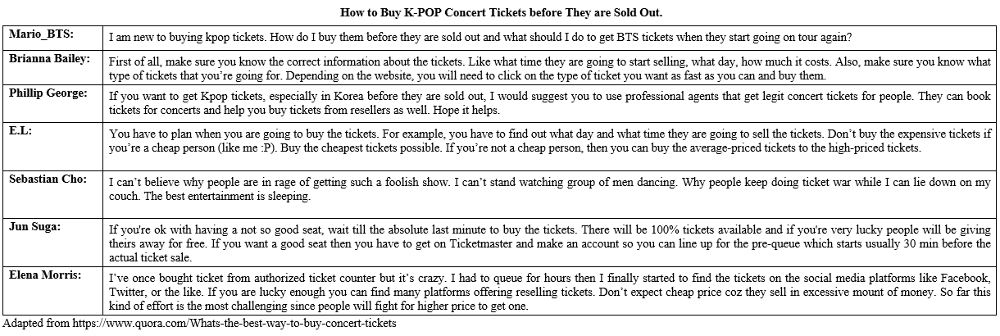

### 1.

**Soal:** What is the above thread mainly concerned?

- A. The effort to get the best view during watching K-POP concert
- B. The idea on how to get K-POP concert tickets before sold out.
- C. Some regulations about how to book K-POP concert tickets.
- D. The K-POP concert tickets war among K-POP enthusiasts.
- E. The excessive price for a piece of K-POP concert tickets.

### 2.

**Soal:** Who posted the least reliable opinion to Mario_BTS’s thread?

- A. E.L. did.
- B. Jun Suga did.
- C. Sebastian Cho did.
- D. Elena Morris did.
- E. Phillip George did.

### 3.

**Soal:** What is the tone of most users of the thread?

- A. Supportive.
- B. Critical.
- C. Skeptical.
- D. Concerned.
- E. Amused.

### 4.

**Soal:** The word ‘legit’ has the closest meaning to

- A. Authorized.
- B. Illegal.
- C. Informal.
- D. Null.
- E. Void.

### 5.

**Soal:** Who suggested to find concert tickets in social media resellers?

- A. E.L. did.
- B. Jun Suga did.
- C. Sebastian Cho did.
- D. Elena Morris did.
- E. Phillip George did.

### 6.

**Question:** Teks 2A       President Obama recognizes that technology is an essential ingredient of economic growth and job creation. Ensuring America has 21st century digital infrastructure, such as high-speed broadband Internet access, fourth-generation (4.0) wireless networks, new health care information technology and a modernized electrical grid, is critical to our long-term prosperity and competitiveness.       The President is committed to ensuring America has a thriving and growing Internet economy. The Internet has become a global platform for communication, commerce and individual expression, and now promises to support breakthroughs in important national priorities such as health care, education and energy. Additionally, the Internet and information technology can be applied to make government more effective, transparent and accessible to all Americans.Adapted from www.whitehouse.gov Text 2B       President Obama has committed to making high-speed wireless services available to at least 98 percent of Americans. The availability of new wireless broadband services will allow more Americans to use the internet to learn, work and play regardless of where they live. At the direction of the President, Federal agencies will make more airwaves available for enhanced smartphones and other wireless services within 10 years.       The President also proposed and signed into law a plan for the design and deployment of a nationwide wireless public safety network so that our first responders can share data and work together seamlessly across jurisdictions in response to natural or man-made emergencies. Through the auctioning of airwave space to companies that will develop the next generation of wireless services, funding will be available to support advances in security, reliability, and other critical features by investing in research and development in wireless technology, while also delivering an estimated $10 billion for deficit reduction.Adapted from www.whitehouse.gov

**Soal:** What is the topic discussed in both passages?

- A. America's policy on the internet and airwaves.
- B. The United States policy on communication technology.
- C. Obama's long term planning for use of mobile technology.
- D. President's policy on technology for Americans prosperity.
- E. The importance of the internet for American's economic growth.

### 7.

**Question:** Teks 2A       President Obama recognizes that technology is an essential ingredient of economic growth and job creation. Ensuring America has 21st century digital infrastructure, such as high-speed broadband Internet access, fourth-generation (4.0) wireless networks, new health care information technology and a modernized electrical grid, is critical to our long-term prosperity and competitiveness.       The President is committed to ensuring America has a thriving and growing Internet economy. The Internet has become a global platform for communication, commerce and individual expression, and now promises to support breakthroughs in important national priorities such as health care, education and energy. Additionally, the Internet and information technology can be applied to make government more effective, transparent and accessible to all Americans.Adapted from www.whitehouse.gov Text 2B       President Obama has committed to making high-speed wireless services available to at least 98 percent of Americans. The availability of new wireless broadband services will allow more Americans to use the internet to learn, work and play regardless of where they live. At the direction of the President, Federal agencies will make more airwaves available for enhanced smartphones and other wireless services within 10 years.       The President also proposed and signed into law a plan for the design and deployment of a nationwide wireless public safety network so that our first responders can share data and work together seamlessly across jurisdictions in response to natural or man-made emergencies. Through the auctioning of airwave space to companies that will develop the next generation of wireless services, funding will be available to support advances in security, reliability, and other critical features by investing in research and development in wireless technology, while also delivering an estimated $10 billion for deficit reduction.Adapted from www.whitehouse.gov

**Soal:** Which of the following statements contain an opinion?

- A. The internet has become a global platform for communication
- B. Internet and information technology can be applied to make government more effective.
- C. Obama has proposed and signed into law a plan for the design and deployment of safety network.
- D. America has 21st century digital infrastructure such as high speed broadband internet access.
- E. Obama has commited to making, high speed wireless services available to Americans.

### 8.

**Question:** Teks 2A       President Obama recognizes that technology is an essential ingredient of economic growth and job creation. Ensuring America has 21st century digital infrastructure, such as high-speed broadband Internet access, fourth-generation (4.0) wireless networks, new health care information technology and a modernized electrical grid, is critical to our long-term prosperity and competitiveness.       The President is committed to ensuring America has a thriving and growing Internet economy. The Internet has become a global platform for communication, commerce and individual expression, and now promises to support breakthroughs in important national priorities such as health care, education and energy. Additionally, the Internet and information technology can be applied to make government more effective, transparent and accessible to all Americans.Adapted from www.whitehouse.gov Text 2B       President Obama has committed to making high-speed wireless services available to at least 98 percent of Americans. The availability of new wireless broadband services will allow more Americans to use the internet to learn, work and play regardless of where they live. At the direction of the President, Federal agencies will make more airwaves available for enhanced smartphones and other wireless services within 10 years.       The President also proposed and signed into law a plan for the design and deployment of a nationwide wireless public safety network so that our first responders can share data and work together seamlessly across jurisdictions in response to natural or man-made emergencies. Through the auctioning of airwave space to companies that will develop the next generation of wireless services, funding will be available to support advances in security, reliability, and other critical features by investing in research and development in wireless technology, while also delivering an estimated $10 billion for deficit reduction.Adapted from www.whitehouse.gov

**Soal:** The sentence “The availability of new wireless broadband services will allow more Americans to use the internet to learn, work and play regardless of where they live.” can be best restated as

- A. Americans will be unable to use the internet to study, work or play wherever they live without new wireless broadband services.
- B. As new wireless broadband services become available, more Americans will be able to use the internet to learn, work and play wherever they live.
- C. The availability of new wireless broadband services will enable more Americans to use the internet to study, work and play depending on where they live.
- D. As new wireless broadband services become available, fewer Americans will be prevented from using the internet to study, work and play but it depends on where you live.
- E. New wireless broadband services will reduce the number of Americans using the internet to study, work and play wherever they live.

### 9.

**Question:** Teks 2A       President Obama recognizes that technology is an essential ingredient of economic growth and job creation. Ensuring America has 21st century digital infrastructure, such as high-speed broadband Internet access, fourth-generation (4.0) wireless networks, new health care information technology and a modernized electrical grid, is critical to our long-term prosperity and competitiveness.       The President is committed to ensuring America has a thriving and growing Internet economy. The Internet has become a global platform for communication, commerce and individual expression, and now promises to support breakthroughs in important national priorities such as health care, education and energy. Additionally, the Internet and information technology can be applied to make government more effective, transparent and accessible to all Americans.Adapted from www.whitehouse.gov Text 2B       President Obama has committed to making high-speed wireless services available to at least 98 percent of Americans. The availability of new wireless broadband services will allow more Americans to use the internet to learn, work and play regardless of where they live. At the direction of the President, Federal agencies will make more airwaves available for enhanced smartphones and other wireless services within 10 years.       The President also proposed and signed into law a plan for the design and deployment of a nationwide wireless public safety network so that our first responders can share data and work together seamlessly across jurisdictions in response to natural or man-made emergencies. Through the auctioning of airwave space to companies that will develop the next generation of wireless services, funding will be available to support advances in security, reliability, and other critical features by investing in research and development in wireless technology, while also delivering an estimated $10 billion for deficit reduction.Adapted from www.whitehouse.gov

**Soal:** Where in the passages does the author mentions that the users can share any data across jurisdictions?

- A. Paragraph 1 text 2A.
- B. Paragraph 2 text 2A.
- C. Paragraph 1 text 2B.
- D. Paragraph 2 text 2B.
- E. None of the texts.

### 10.

**Question:** Teks 2A       President Obama recognizes that technology is an essential ingredient of economic growth and job creation. Ensuring America has 21st century digital infrastructure, such as high-speed broadband Internet access, fourth-generation (4.0) wireless networks, new health care information technology and a modernized electrical grid, is critical to our long-term prosperity and competitiveness.       The President is committed to ensuring America has a thriving and growing Internet economy. The Internet has become a global platform for communication, commerce and individual expression, and now promises to support breakthroughs in important national priorities such as health care, education and energy. Additionally, the Internet and information technology can be applied to make government more effective, transparent and accessible to all Americans.Adapted from www.whitehouse.gov Text 2B       President Obama has committed to making high-speed wireless services available to at least 98 percent of Americans. The availability of new wireless broadband services will allow more Americans to use the internet to learn, work and play regardless of where they live. At the direction of the President, Federal agencies will make more airwaves available for enhanced smartphones and other wireless services within 10 years.       The President also proposed and signed into law a plan for the design and deployment of a nationwide wireless public safety network so that our first responders can share data and work together seamlessly across jurisdictions in response to natural or man-made emergencies. Through the auctioning of airwave space to companies that will develop the next generation of wireless services, funding will be available to support advances in security, reliability, and other critical features by investing in research and development in wireless technology, while also delivering an estimated $10 billion for deficit reduction.Adapted from www.whitehouse.gov

**Soal:** What will likely happen in the future if the availability of broadband services are higher?

- A. It will develop new government so that the people will get anything they want.
- B. It will create unemployment across nations.
- C. It will halt the process of learning and increase illiteracy rate.
- D. It will boost government performance for goods and services for Americans.
- E. It will allow more Americans to use internet for learning and working.

### 11.

**Question:** Text 3       A huge study, published this summer in the British Medical Journal, seemed to indicate that a diet filled with spices – including chilies – was beneficial for health. A team at the Chinese Academy of Medical Sciences tracked the health of nearly half a million participants in China for several years. They found that participants who said they ate spicy food once or twice a week had a mortality rate 10% lower than those who ate spicy food less than once a week. Risk of death reduced still further for hot-heads who ate spicy food six or seven days a week.       Chili peppers were the most commonly used spice among the sample, and those who ate fresh chili had a lower risk of death from cancer, coronary heart disease and diabetes. One of the authors of the study, Lu Qi – who confesses that he is very keen on spicy food – says there are likely to be many reasons for this effect. “The data encourages people to eat more spicy food to improve health and reduce mortality risk at an early age,” says Qi, a nutritionist at the Harvard TH Chan School of Public Health.       While the health-promoting properties of chilies may not be fully understood, at least we have a good idea where to look to find the source of them. Cut a chili open and you will see yellow placenta-like fronds that attach the seeds to the inside of the fruit. In most types of chili, this is the location of the spice’s secret weapon - capsaicin. It is capsaicin that makes chilies hot. The heat is measured in Scoville heat units, which is the number of times a sample of dissolved dried chili must be diluted by its own weight in sugar water before it loses its heat. For a green bell pepper this is zero. However, the Aztec codices also tell us that they put chili on their teeth to kill toothache pain, and the use of capsaicin as an analgesic also continues to this day.       Several studies have also indicated that capsaicin has powerful anti-cancer properties. It has been found to be helpful in fighting human prostate and lung cancer cells in mice, and there are also indications that it could be used as a treatment for colon cancer. It may also improve drug resistance for bile-duct cancer sufferers. Capsaicin creams and patches are available in chemists to ease pain. But it’s only in the past 20 years that we have come to understand the contradiction of how something that causes pain can ease it too. Capsaicin binds to the pain receptor TRPV1, which our brains also use to detect changes in temperature – that’s why we think chilies are hot.Adapted from https://www.bbc.com

**Soal:** What does the author mainly discuss?

- A. The origin of chillies.
- B. The properties of chillies.
- C. The health benefits of chillies.
- D. The popularity of chillies in the world.
- E. How chillies make people addicted.

### 12.

**Question:** Text 3       A huge study, published this summer in the British Medical Journal, seemed to indicate that a diet filled with spices – including chilies – was beneficial for health. A team at the Chinese Academy of Medical Sciences tracked the health of nearly half a million participants in China for several years. They found that participants who said they ate spicy food once or twice a week had a mortality rate 10% lower than those who ate spicy food less than once a week. Risk of death reduced still further for hot-heads who ate spicy food six or seven days a week.       Chili peppers were the most commonly used spice among the sample, and those who ate fresh chili had a lower risk of death from cancer, coronary heart disease and diabetes. One of the authors of the study, Lu Qi – who confesses that he is very keen on spicy food – says there are likely to be many reasons for this effect. “The data encourages people to eat more spicy food to improve health and reduce mortality risk at an early age,” says Qi, a nutritionist at the Harvard TH Chan School of Public Health.       While the health-promoting properties of chilies may not be fully understood, at least we have a good idea where to look to find the source of them. Cut a chili open and you will see yellow placenta-like fronds that attach the seeds to the inside of the fruit. In most types of chili, this is the location of the spice’s secret weapon - capsaicin. It is capsaicin that makes chilies hot. The heat is measured in Scoville heat units, which is the number of times a sample of dissolved dried chili must be diluted by its own weight in sugar water before it loses its heat. For a green bell pepper this is zero. However, the Aztec codices also tell us that they put chili on their teeth to kill toothache pain, and the use of capsaicin as an analgesic also continues to this day.       Several studies have also indicated that capsaicin has powerful anti-cancer properties. It has been found to be helpful in fighting human prostate and lung cancer cells in mice, and there are also indications that it could be used as a treatment for colon cancer. It may also improve drug resistance for bile-duct cancer sufferers. Capsaicin creams and patches are available in chemists to ease pain. But it’s only in the past 20 years that we have come to understand the contradiction of how something that causes pain can ease it too. Capsaicin binds to the pain receptor TRPV1, which our brains also use to detect changes in temperature – that’s why we think chilies are hot.Adapted from https://www.bbc.com

**Soal:** Based on the text, which of the following statements is TRUE?

- A. Chilies can be used as a pain killer due to its analgesic content.
- B. Some researchers suggest to consume chillies to cure colon cancer.
- C. People can gain benefit from chillies when they are made into cream.
- D. Chillies are believed to be the best medication for all types of cancers.
- E. People should keep eating chilies as their major consumption in order to avoid the risk of death.

### 13.

**Question:** Text 3       A huge study, published this summer in the British Medical Journal, seemed to indicate that a diet filled with spices – including chilies – was beneficial for health. A team at the Chinese Academy of Medical Sciences tracked the health of nearly half a million participants in China for several years. They found that participants who said they ate spicy food once or twice a week had a mortality rate 10% lower than those who ate spicy food less than once a week. Risk of death reduced still further for hot-heads who ate spicy food six or seven days a week.       Chili peppers were the most commonly used spice among the sample, and those who ate fresh chili had a lower risk of death from cancer, coronary heart disease and diabetes. One of the authors of the study, Lu Qi – who confesses that he is very keen on spicy food – says there are likely to be many reasons for this effect. “The data encourages people to eat more spicy food to improve health and reduce mortality risk at an early age,” says Qi, a nutritionist at the Harvard TH Chan School of Public Health.       While the health-promoting properties of chilies may not be fully understood, at least we have a good idea where to look to find the source of them. Cut a chili open and you will see yellow placenta-like fronds that attach the seeds to the inside of the fruit. In most types of chili, this is the location of the spice’s secret weapon - capsaicin. It is capsaicin that makes chilies hot. The heat is measured in Scoville heat units, which is the number of times a sample of dissolved dried chili must be diluted by its own weight in sugar water before it loses its heat. For a green bell pepper this is zero. However, the Aztec codices also tell us that they put chili on their teeth to kill toothache pain, and the use of capsaicin as an analgesic also continues to this day.       Several studies have also indicated that capsaicin has powerful anti-cancer properties. It has been found to be helpful in fighting human prostate and lung cancer cells in mice, and there are also indications that it could be used as a treatment for colon cancer. It may also improve drug resistance for bile-duct cancer sufferers. Capsaicin creams and patches are available in chemists to ease pain. But it’s only in the past 20 years that we have come to understand the contradiction of how something that causes pain can ease it too. Capsaicin binds to the pain receptor TRPV1, which our brains also use to detect changes in temperature – that’s why we think chilies are hot.Adapted from https://www.bbc.com

**Soal:** ‘It may also improve drug resistance for bile-duct cancer sufferers.’ The underlined word refers to

- A. capsaicin.
- B. prostate cancer.
- C. lung cancer.
- D. colon cancer.
- E. bile-duct cancer.

### 14.

**Question:** Text 3       A huge study, published this summer in the British Medical Journal, seemed to indicate that a diet filled with spices – including chilies – was beneficial for health. A team at the Chinese Academy of Medical Sciences tracked the health of nearly half a million participants in China for several years. They found that participants who said they ate spicy food once or twice a week had a mortality rate 10% lower than those who ate spicy food less than once a week. Risk of death reduced still further for hot-heads who ate spicy food six or seven days a week.       Chili peppers were the most commonly used spice among the sample, and those who ate fresh chili had a lower risk of death from cancer, coronary heart disease and diabetes. One of the authors of the study, Lu Qi – who confesses that he is very keen on spicy food – says there are likely to be many reasons for this effect. “The data encourages people to eat more spicy food to improve health and reduce mortality risk at an early age,” says Qi, a nutritionist at the Harvard TH Chan School of Public Health.       While the health-promoting properties of chilies may not be fully understood, at least we have a good idea where to look to find the source of them. Cut a chili open and you will see yellow placenta-like fronds that attach the seeds to the inside of the fruit. In most types of chili, this is the location of the spice’s secret weapon - capsaicin. It is capsaicin that makes chilies hot. The heat is measured in Scoville heat units, which is the number of times a sample of dissolved dried chili must be diluted by its own weight in sugar water before it loses its heat. For a green bell pepper this is zero. However, the Aztec codices also tell us that they put chili on their teeth to kill toothache pain, and the use of capsaicin as an analgesic also continues to this day.       Several studies have also indicated that capsaicin has powerful anti-cancer properties. It has been found to be helpful in fighting human prostate and lung cancer cells in mice, and there are also indications that it could be used as a treatment for colon cancer. It may also improve drug resistance for bile-duct cancer sufferers. Capsaicin creams and patches are available in chemists to ease pain. But it’s only in the past 20 years that we have come to understand the contradiction of how something that causes pain can ease it too. Capsaicin binds to the pain receptor TRPV1, which our brains also use to detect changes in temperature – that’s why we think chilies are hot.Adapted from https://www.bbc.com

**Soal:** In the passage there is a statement like this:       “The data encourages people to eat more spicy food to improve health and reduce mortality risk at an early age, says Qi, a nutritionist at the Harvard TH Chan School of Public Health”        If people consume more spicy food, it _____ increase mortality risk at an early age.

- A. shall
- B. will not
- C. must
- D. will
- E. could

### 15.

**Question:** Text 3       A huge study, published this summer in the British Medical Journal, seemed to indicate that a diet filled with spices – including chilies – was beneficial for health. A team at the Chinese Academy of Medical Sciences tracked the health of nearly half a million participants in China for several years. They found that participants who said they ate spicy food once or twice a week had a mortality rate 10% lower than those who ate spicy food less than once a week. Risk of death reduced still further for hot-heads who ate spicy food six or seven days a week.       Chili peppers were the most commonly used spice among the sample, and those who ate fresh chili had a lower risk of death from cancer, coronary heart disease and diabetes. One of the authors of the study, Lu Qi – who confesses that he is very keen on spicy food – says there are likely to be many reasons for this effect. “The data encourages people to eat more spicy food to improve health and reduce mortality risk at an early age,” says Qi, a nutritionist at the Harvard TH Chan School of Public Health.       While the health-promoting properties of chilies may not be fully understood, at least we have a good idea where to look to find the source of them. Cut a chili open and you will see yellow placenta-like fronds that attach the seeds to the inside of the fruit. In most types of chili, this is the location of the spice’s secret weapon - capsaicin. It is capsaicin that makes chilies hot. The heat is measured in Scoville heat units, which is the number of times a sample of dissolved dried chili must be diluted by its own weight in sugar water before it loses its heat. For a green bell pepper this is zero. However, the Aztec codices also tell us that they put chili on their teeth to kill toothache pain, and the use of capsaicin as an analgesic also continues to this day.       Several studies have also indicated that capsaicin has powerful anti-cancer properties. It has been found to be helpful in fighting human prostate and lung cancer cells in mice, and there are also indications that it could be used as a treatment for colon cancer. It may also improve drug resistance for bile-duct cancer sufferers. Capsaicin creams and patches are available in chemists to ease pain. But it’s only in the past 20 years that we have come to understand the contradiction of how something that causes pain can ease it too. Capsaicin binds to the pain receptor TRPV1, which our brains also use to detect changes in temperature – that’s why we think chilies are hot.Adapted from https://www.bbc.com

**Soal:** What makes capsaicin to be helpful in fighting some cancers?

- A. It may improve drug resistance.
- B. Capsaicin has powerful anti-cancer properties.
- C. It has substances which control temperature.
- D. It improves health and reduces mortality risk.
- E. Capsaicin has analgesic properties to fight cancer cell.

### 16.

**Question:** Text 4       Children given more fast food meals will grow up to have a lower IQ than those who regularly eat freshly-cooked meals, according to a study.        Childhood nutrition has long lasting effects on IQ, even after previous intelligence and wealth and social status are taken into account, it found. The study examined whether the type of main meal that children ate each day had an impact on their cognitive ability and growth.       It looked at 4,000 Scottish children aged three to five years old and compared fast food with freshly-cooked food. The study, undertaken by an academic at Goldsmiths, University of London, found that parents with a higher socio-economic status reported that they gave their children meals prepared with fresh ingredients more often, which positively affected their IQ.       Lower socio-economic status was linked to more children having fast food, which led to lower intelligence. Dr. Sophie von Stumm, from the department of psychology at Goldsmiths, said "It is common sense that the type of food we eat will affect brain development, but previous research has only looked at the effects of specific food groups on children's IQ rather than at generic types of meals.       (1.) She said her findings highlighted that differences in children's meals were also a social problem. (2) "Mothers and fathers from less privileged backgrounds often have less time to prepare a freshly cooked meal from scratch for their children," Dr Stumm said. (3) "These children score lower on intelligence tests and often struggle in school. (4) It eventually gives them an opportunity to demonstrate their ability at school. (5) It shows that the freshness and quality of food matters more than just being full, in particular when children are young," she added.       Similar discoveries were made in an Australian study published in August. It found that toddlers on a diet of drinks and sweets were less bright as they got older. By the age of eight, the 'junk food' children had IQs up to two points lower than their healthy counterparts, according to the researchers from the University of Adelaide. The researchers suspected that the negative effect of eating junk food so early in life may not be altered by future healthy habits because brain development is hinderedAdapted from https://www.thedailystar.net/

**Soal:** The author presents the impacts of drinks and sweets on children’s brain development in

- A. paragraph 2.
- B. paragraph 3.
- C. paragraph 4.
- D. paragraph 5.
- E. paragraph 6.

### 17.

**Question:** Text 4       Children given more fast food meals will grow up to have a lower IQ than those who regularly eat freshly-cooked meals, according to a study.        Childhood nutrition has long lasting effects on IQ, even after previous intelligence and wealth and social status are taken into account, it found. The study examined whether the type of main meal that children ate each day had an impact on their cognitive ability and growth.       It looked at 4,000 Scottish children aged three to five years old and compared fast food with freshly-cooked food. The study, undertaken by an academic at Goldsmiths, University of London, found that parents with a higher socio-economic status reported that they gave their children meals prepared with fresh ingredients more often, which positively affected their IQ.       Lower socio-economic status was linked to more children having fast food, which led to lower intelligence. Dr. Sophie von Stumm, from the department of psychology at Goldsmiths, said "It is common sense that the type of food we eat will affect brain development, but previous research has only looked at the effects of specific food groups on children's IQ rather than at generic types of meals.       (1.) She said her findings highlighted that differences in children's meals were also a social problem. (2) "Mothers and fathers from less privileged backgrounds often have less time to prepare a freshly cooked meal from scratch for their children," Dr Stumm said. (3) "These children score lower on intelligence tests and often struggle in school. (4) It eventually gives them an opportunity to demonstrate their ability at school. (5) It shows that the freshness and quality of food matters more than just being full, in particular when children are young," she added.       Similar discoveries were made in an Australian study published in August. It found that toddlers on a diet of drinks and sweets were less bright as they got older. By the age of eight, the 'junk food' children had IQs up to two points lower than their healthy counterparts, according to the researchers from the University of Adelaide. The researchers suspected that the negative effect of eating junk food so early in life may not be altered by future healthy habits because brain development is hinderedAdapted from https://www.thedailystar.net/

**Soal:** The author would apparently agree that the discussion of fast food and IQ in the text is similar to the phenomenon between

- A. insuline and immunity.
- B. ticket and aeroplane.
- C. speed and traffic light.
- D. honey and bee.
- E. cholesterol and health.

### 18.

**Question:** Text 4       Children given more fast food meals will grow up to have a lower IQ than those who regularly eat freshly-cooked meals, according to a study.        Childhood nutrition has long lasting effects on IQ, even after previous intelligence and wealth and social status are taken into account, it found. The study examined whether the type of main meal that children ate each day had an impact on their cognitive ability and growth.       It looked at 4,000 Scottish children aged three to five years old and compared fast food with freshly-cooked food. The study, undertaken by an academic at Goldsmiths, University of London, found that parents with a higher socio-economic status reported that they gave their children meals prepared with fresh ingredients more often, which positively affected their IQ.       Lower socio-economic status was linked to more children having fast food, which led to lower intelligence. Dr. Sophie von Stumm, from the department of psychology at Goldsmiths, said "It is common sense that the type of food we eat will affect brain development, but previous research has only looked at the effects of specific food groups on children's IQ rather than at generic types of meals.       (1.) She said her findings highlighted that differences in children's meals were also a social problem. (2) "Mothers and fathers from less privileged backgrounds often have less time to prepare a freshly cooked meal from scratch for their children," Dr Stumm said. (3) "These children score lower on intelligence tests and often struggle in school. (4) It eventually gives them an opportunity to demonstrate their ability at school. (5) It shows that the freshness and quality of food matters more than just being full, in particular when children are young," she added.       Similar discoveries were made in an Australian study published in August. It found that toddlers on a diet of drinks and sweets were less bright as they got older. By the age of eight, the 'junk food' children had IQs up to two points lower than their healthy counterparts, according to the researchers from the University of Adelaide. The researchers suspected that the negative effect of eating junk food so early in life may not be altered by future healthy habits because brain development is hinderedAdapted from https://www.thedailystar.net/

**Soal:** Which of the statement in paragraph 5 is NOT relevant to the topic discussed in the passage?

- A. Statement 1.
- B. Statement 2.
- C. Statement 3.
- D. Statement 4.
- E. Statement 5

### 19.

**Question:** Text 4       Children given more fast food meals will grow up to have a lower IQ than those who regularly eat freshly-cooked meals, according to a study.        Childhood nutrition has long lasting effects on IQ, even after previous intelligence and wealth and social status are taken into account, it found. The study examined whether the type of main meal that children ate each day had an impact on their cognitive ability and growth.       It looked at 4,000 Scottish children aged three to five years old and compared fast food with freshly-cooked food. The study, undertaken by an academic at Goldsmiths, University of London, found that parents with a higher socio-economic status reported that they gave their children meals prepared with fresh ingredients more often, which positively affected their IQ.       Lower socio-economic status was linked to more children having fast food, which led to lower intelligence. Dr. Sophie von Stumm, from the department of psychology at Goldsmiths, said "It is common sense that the type of food we eat will affect brain development, but previous research has only looked at the effects of specific food groups on children's IQ rather than at generic types of meals.       (1.) She said her findings highlighted that differences in children's meals were also a social problem. (2) "Mothers and fathers from less privileged backgrounds often have less time to prepare a freshly cooked meal from scratch for their children," Dr Stumm said. (3) "These children score lower on intelligence tests and often struggle in school. (4) It eventually gives them an opportunity to demonstrate their ability at school. (5) It shows that the freshness and quality of food matters more than just being full, in particular when children are young," she added.       Similar discoveries were made in an Australian study published in August. It found that toddlers on a diet of drinks and sweets were less bright as they got older. By the age of eight, the 'junk food' children had IQs up to two points lower than their healthy counterparts, according to the researchers from the University of Adelaide. The researchers suspected that the negative effect of eating junk food so early in life may not be altered by future healthy habits because brain development is hinderedAdapted from https://www.thedailystar.net/

**Soal:** Based on the passage, if children are given freshly prepared food everyday, ____

- A. their IQ will increasingly raise year by year.
- B. their brain development won’t be affected.
- C. It will definitely influence their IQ.
- D. it will increase their calorie intake.
- E. their brain development is halted.

### 20.

**Question:** Text 4       Children given more fast food meals will grow up to have a lower IQ than those who regularly eat freshly-cooked meals, according to a study.        Childhood nutrition has long lasting effects on IQ, even after previous intelligence and wealth and social status are taken into account, it found. The study examined whether the type of main meal that children ate each day had an impact on their cognitive ability and growth.       It looked at 4,000 Scottish children aged three to five years old and compared fast food with freshly-cooked food. The study, undertaken by an academic at Goldsmiths, University of London, found that parents with a higher socio-economic status reported that they gave their children meals prepared with fresh ingredients more often, which positively affected their IQ.       Lower socio-economic status was linked to more children having fast food, which led to lower intelligence. Dr. Sophie von Stumm, from the department of psychology at Goldsmiths, said "It is common sense that the type of food we eat will affect brain development, but previous research has only looked at the effects of specific food groups on children's IQ rather than at generic types of meals.       (1.) She said her findings highlighted that differences in children's meals were also a social problem. (2) "Mothers and fathers from less privileged backgrounds often have less time to prepare a freshly cooked meal from scratch for their children," Dr Stumm said. (3) "These children score lower on intelligence tests and often struggle in school. (4) It eventually gives them an opportunity to demonstrate their ability at school. (5) It shows that the freshness and quality of food matters more than just being full, in particular when children are young," she added.       Similar discoveries were made in an Australian study published in August. It found that toddlers on a diet of drinks and sweets were less bright as they got older. By the age of eight, the 'junk food' children had IQs up to two points lower than their healthy counterparts, according to the researchers from the University of Adelaide. The researchers suspected that the negative effect of eating junk food so early in life may not be altered by future healthy habits because brain development is hinderedAdapted from https://www.thedailystar.net/

**Soal:** Here are the jumbled sentences from the paragraph that follows the last paragraph of the passage. Please reorder the following sentences:a.  Sometimes a society has to help a person change, we need to be educating more young parents about healthy eating.b.  Experts in the field said the results had confirmed common sense.c.  Although the relationship between diet and IQ was very strong, the impact was quite small.d.  Processed foods were linked with IQs only a few points lower.e.  The research confirms the type of advice we already know, but that's not always enough.

- A. a – b – c – d – e
- B. b – c – a – e – d.
- C. c – d – b – e – a.
- D. c – a – b – e – d.
- E. d – e – a – b – c.

