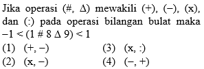

### 1.

- A. P > Q
- B. P = Q
- C. P < Q
- D. Tidak dapat ditentukan hubungan

### 2.

- A. -1.
- B. 0.
- C. 1.
- D. 2.
- E. 3.

### 3.

- A. 7.
- B. 8.
- C. 
- D. 
- E. 9.

### 4.

**Soal:** Jajar genjang PQRS memiliki luas 28. Titik T terletak pada QR sehingga ST tegak lurus terhadap QRJika (a, b) adalah koordinat S, maka nilai a - 2b adalah

- A. -7
- B. ​-8
- C. -9
- D. -10
- E. -11

### 5.

**Soal:** Sistem persamaan linear dalam variabel x, y, dan z sebagai berikut3x − 2y − 2z = 3x − y = my + z = 6 Memiliki solusi x = a, y = b, dan z = c. Pernyataan mana saja yang bernilai benar?(1)   a = 5(2)   y = 3 jika m = 2(3)   c > 1 jika m > 0(4)   c = 3

- A. 1, 2, 3
- B. 1, 3
- C. 2, 4
- D. 4 saja
- E. 1, 2, 3, 4

### 6.

- A. 1, 2, 3 benar.
- B. 1 dan 3 benar.
- C. 2 dan 4 benar.
- D. 4 saja benar.
- E. Semua benar.

### 7.

- A. -3.
- B. -1.
- C. 0.
- D. 1.
- E. 3.

### 8.

**Soal:** z, 4, 8, 16 adalah barisan geometri.Perbandingan suku ke-4 dan suku ke-10 =

- A. 1 : 8.
- B. 1 : 16.
- C. 1 : 32.
- D. 1 : 64.
- E. 1 : 128.

### 9.

**Soal:** Untuk membuat coran satu tiang bangunan dibutuhkan 2 karung semen dan 3 karung pasir. Untuk membuat 4 tiang dibutuhkan x karung semen dan y karung pasir. Manakah hubungan yang benar antara kuantitas P dan Q berikut berdasarkan informasi yang diberikan?

- A. P > Q.
- B. P < Q.
- C. P = Q.
- D. Informasi yang diberikan tidak cukup untuk memutuskan salah satu dari tiga pilihan di atas.

### 10.

- A. -2.
- B. -1.
- C. 0.
- D. 1.
- E. 2.

### 11.

- A. -2.
- B. -1.
- C. 0.
- D. 1.
- E. 2.

### 12.

**Soal:** Pada Kubus ABCD.EFGH dengan panjang rusuk 8 cm, O adalah titik pusat sisi ADHE. Jarak B ke O adalah ... cm.

- A. 
- B. 
- C. 
- D. 
- E. 

### 13.

- A. 
- B. 
- C. 1.
- D. 
- E. 

### 14.

**Soal:** Jarak jalan suatu kota adalah 4 km. Terdapat rombongan karnaval dengan panjang mobil dan kendaraan lain sekitar 2 - 4 meter dengan jarak antar kendaraan sekitar 2 - 5 meter. Maka banyak minimal kendaraan adalah X.

- A. P < Q.
- B. P > Q.
- C. P = Q.
- D. P = 2Q.
- E. P = 3Q.

### 15.

- A. 1, 2, dan 3 benar.
- B. 1 dan 3 benar.
- C. 2 dan 4 benar.
- D. 4 saja benar.
- E. semua benar.

### 16.

**Soal:** Perhatikan gambar!Bangun datar di atas dicerminkan terhadap garis y = -2.Manakah pernyataan berikut yang benar?

- A. Semua daerah A ada di kuadran I
- B. Sebagian daerah A ada di kuadran I
- C. Semua daerah A ada di kuadran IV
- D. Semua daerah B ada di kuadran IV
- E. Sebagian daerah C ada di kuadran I

### 17.

**Soal:** Ibu membuat roti dengan komposisi 1 roti membutuhkan 3 kg tepung dan 2 kg gula pasir.Jika ibu ingin membuat 2 roti, lalu menjualnya dengan harga Rp90.000,00/roti. Manakah hubungan yang benar kuantitas P dan Q berikut berdasarkan informasi yang diberikan?

- A. P > Q.
- B. P < Q.
- C. P = Q.
- D. P = 2Q.
- E. Informasi di atas tidak cukup untuk memutuskan satu dari 4 pilihan.

### 18.

- A. a = 1, b = 2.
- B. a = 2, b =1.
- C. a = 5, b = -2.
- D. a = -2 , b = 5.
- E. a = 4, b = -1.

### 19.

**Soal:** Diketahui barisan aritmetika dengan Un adalah suku ke-n. Jika U2 + U8 + U23 = 120 maka U11 =

- A. 36.
- B. 40.
- C. 55.
- D. 63.
- E. 72.

### 20.

- A. (1), (2), dan (3) yang benar.
- B. (1) dan (3) yang benar.
- C. (2) dan (4) yang benar.
- D. Hanya (4) yang benar.
- E. Semua pilihan benar.

