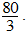

### 1.

**Soal:** Selisih pendapatan Maskapai Penerbangan Gatotkaca pada hari Senin dan Minggu tanpa biaya ekstra pada setiap jadwal adalah

- A. Rp97.600.000,00.
- B. Rp107.400.000,00.
- C. Rp112.600.000,00.
- D. Rp127.200.000,00.
- E. Rp146.400.000,00.

### 2.

**Soal:** Jika pada hari Sabtu 50% dari penumpang pada setiap jadwal memilih ekstra bagasi dan dua per tiga dari sisanya memilih hotseat, jumlah penumpang yang memilih ekstra bagasi  atau hotseatadalah …. (Tulis jawaban Anda dengan bilangan cacah)

### Soal Essay
### 3.

**Question:** Andi, Budi, dan Cici menabung dengan mengikuti barisan aritmetika. Andi menabung setiap bulan mulai Agustus 2024 sebesar Rp50.000,00 dengan beda Rp50.000,00. Budi menabung per dua bulan mulai bulan Agustus 2024 sebesar Rp100.000,00 dengan beda Rp150.000,00. Sedangkan Cici menabung setiap bulan mulai Oktober 2024.

**Soal:** Jumlah tabungan Andi dan Budi sampai bulan Maret 2025 adalah

- A. Rp3.000.000,00.
- B. Rp3.100.000,00.
- C. Rp3.500.000,00.
- D. Rp4.100.000,00.
- E. Rp4.200.000,00.

### 4.

**Question:** Andi, Budi, dan Cici menabung dengan mengikuti barisan aritmetika. Andi menabung setiap bulan mulai Agustus 2024 sebesar Rp50.000,00 dengan beda Rp50.000,00. Budi menabung per dua bulan mulai bulan Agustus 2024 sebesar Rp100.000,00 dengan beda Rp150.000,00. Sedangkan Cici menabung setiap bulan mulai Oktober 2024.

**Soal:** Jika beda tabungan Cici setiap bulan sebesar Rp50.000,00, maka besar tabungan awal Cici agar jumlah tabungannya di bulan Mei 2025 sama dengan jumlah tabungan Budi adalah

- A. Rp50.000,00.
- B. Rp75.000,00.
- C. Rp100.000,00.
- D. Rp125.000,00.
- E. Rp150.000,00.

### 5.

**Soal:** Pada gambar di atas, panjang AC adalah ... cm

- A. 
- B. 
- C. 
- D. 
- E. 

### 6.

**Soal:** Panjang AC maksimum adalah ... cm.

- A. 
- B. 
- C. 
- D. 
- E. 

### 7.

**Soal:** Panjang AC minimum adalah ... cm

- A. 
- B. 
- C. 
- D. 
- E. 

### 8.

**Soal:** Jika luas jalan yang dipasang paving block 6p m2, maka lebar jalan dapat memuat mobil dan ukuran mobil berikut (jarak antarmobil 1 m)(1)   1 mobil selebar 2,5 m.(2)   2 mobil selebar 2,5 m.(3)   3 mobil selebar 2,5 m.Pernyataan yang memenuhi adalah

- A. 1 saja.
- B. 2 saja.
- C. 1 dan 3.
- D. 1 dan 2
- E. 1, 2, dan 3.

### 9.

**Soal:** Jika pekerja memasang paving block pada  jalan seluas 2.000 m2 maka lama pengerjaan pemasangan paving block untuk jalan tersebut adalah

- A. 20 jam 30 menit.
- B. 20 jam 50 menit.
- C. 21 jam 30 menit.
- D. 21 jam 50 menit.
- E. 22 jam.

### 10.

**Soal:** Jika luas jalan 2.000 m2 maka biaya untuk membeli  paving block  adalah

- A. Rp40.000.000,00.
- B. Rp45.000.000,00.
- C. Rp50.000.000,00.
- D. Rp55.000.000,00.
- E. Rp59.000.000,00.

### 11.

**Soal:** Radius kedua kapur barus akan sama setelah hari ke

- A. 
- B. 
- C. 20.
- D. 40.
- E. 60.

### 12.

**Soal:** Radius kapur barus biru menjadi seperempat dari radius kapur barus kuning setelah hari ke

- A. 100.
- B. 80.
- C. 40.
- D. 
- E. 

### 13.

**Soal:** Perbandingan tinggi kapur barus kuning dan tinggi kapur barus biru akan menjadi 8 : 1 setelah hari ke

- A. 
- B. 
- C. 40.
- D. 80.
- E. 100.

### 14.

**Soal:** Setelah hari ke-60 perbandingan volume kapur barus kuning dan kapur barus biru menjadi

- A. 1 : 16.
- B. 1 : 4.
- C. 1 : 8.
- D. 8 : 1.
- E. 16 : 1.

### 15.

**Question:** Ibu Susi berjualan kue yang telah dikemas per bungkus. Setiap bungkus berisi satu potong kue A, kue B, kue C, dan kue D. Ibu Susi membeli kue-kue tersebut perloyang.

**Soal:** Potongan kue dimasukan dalam kemasan perbungkus dan tidak ada sisa potongan kue, Ibu Susi harus membeli kue A, B, C, dan D berturut-turut minimal sebanyak ... loyang.

- A. 3, 4, 4, dan 5
- B. 3, 4, 4, dan 6
- C. 3, 5, 5, dan 6
- D. 3, 6, 6, dan 6
- E. 4, 6, 6, dan 6

### 16.

**Question:** Ibu Susi berjualan kue yang telah dikemas per bungkus. Setiap bungkus berisi satu potong kue A, kue B, kue C, dan kue D. Ibu Susi membeli kue-kue tersebut perloyang.

**Soal:** Apabila Ibu Susi membeli empat loyang kue A, banyak minimum potongan kue yang tidak dimasukan dalam kemasan kantong jika seluruh kue A terjual adalah ... potong.

- A. 4
- B. 6
- C. 10
- D. 12
- E. 18

### 17.

**Question:** Ibu Susi berjualan kue yang telah dikemas per bungkus. Setiap bungkus berisi satu potong kue A, kue B, kue C, dan kue D. Ibu Susi membeli kue-kue tersebut perloyang.

**Soal:** Ibu Susi dapat  menjual 100 bungkus kue maka modal yang dikeluarkan oleh Ibu Susi adalah

- A. Rp2.200.000,00.
- B. Rp2.740.000,00.
- C. Rp3.200.000,00.
- D. Rp3.470.000,00.
- E. Rp3.640.000,00.

### 18.

**Question:** Ibu Susi berjualan kue yang telah dikemas per bungkus. Setiap bungkus berisi satu potong kue A, kue B, kue C, dan kue D. Ibu Susi membeli kue-kue tersebut perloyang.

**Soal:** Ibu Susi menginginkan untung 10 % setiap loyang kue. Harga jual kue per bungkus adalahJawablah soal berikut dengan mengetikkan jawaban berupa angka (bilangan bulat tanpa koma atau titik)!

### Soal Essay
