### 1.

**Soal:** Perhatikan Algoritma yang disajikan pada diagram berikut.Keterangan :FPB (w, y) menyatakan faktor persekutuan terbesar dari w dan y.Bilangan bulat positif k dan m dengan k < 10 dan memenuhi kedua pernyataan berikut.Input p = 3 menghasilkan x = 10. Input p = 4 menghasilkan x = 3. Nilai m adalah ….

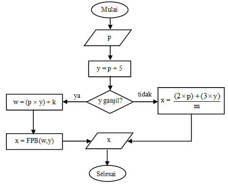

- A. 1.
- B. 2.
- C. 3.
- D. 4.
- E. 5.

### 2.

**Soal:** Perhatikan Algoritma yang disajikan pada diagram berikut.Keterangan :FPB (w, y) menyatakan faktor persekutuan terbesar dari w dan y.Bilangan bulat positif k dan m dengan k < 10 dan memenuhi kedua pernyataan berikut.Input p = 3 menghasilkan x = 10. Input p = 4 menghasilkan x = 3. Jika di input p = 4, maka nilai k = ....

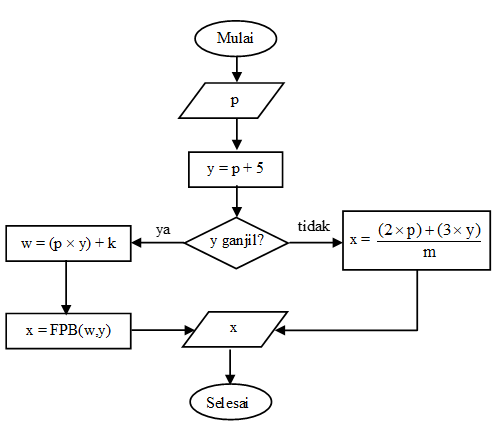

- A. 1
- B. 2
- C. 3
- D. 4
- E. 5

### 3.

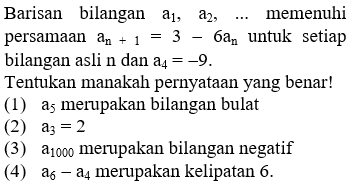

- A. 1, 2, 3, benar
- B. 1, 3 benar
- C. 2, 4 benar
- D. 4 saja benar
- E. semua benar

### 4.

**Soal:** Jajar genjang PQRS memiliki luas 24 satuan luas. Titik T terletak pada QR sehingga ST tegak lurus terhadap QRJika (a, b) adalah koordinat S, maka banyak pernyataan berikut yang benar adalah(1)   a + b = 7(2)   a - b = 1(3)   a x b = 12(4)   a : b = 3

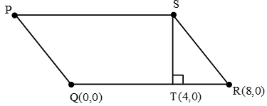

- A. 0
- B. 1
- C. 2
- D. 3
- E. 4

### 5.

**Soal:** Jajar genjang PQRS memiliki luas 24 satuan luas. Titik T terletak pada QR sehingga ST tegak lurus terhadap QRKeliling bangun trapesium PQTS adalah ... satuan panjang

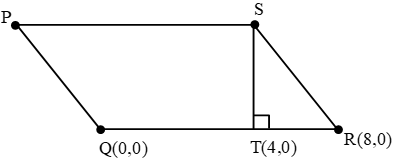

- A. 20.
- B. 21.
- C. 22.
- D. 23.
- E. 24.

### 6.

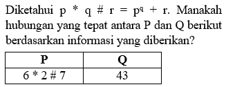

- A. P > Q.
- B. Q > P.
- C. P = Q.
- D. P = 2Q.
- E. Informasi yang diberikan tidak cukup untuk memutuskan salah satu dari tiga pilihan di atas.

### 7.

**Soal:** Diberikan balok ABCD.EFGH dengan panjang rusuk BC = GC = 4 cm dan AB berkisar antara 6 cm dan 10 cm. Jika titik T terletak di tengah-tengah rusuk FG maka manakah hubungan yang benar antara kuantitas P dan Q berdasarkan informasi yang diberikan?

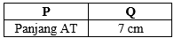

- A. P > Q.
- B. P < Q.
- C. P = Q.
- D. Informasi yang diberikan tidak cukup untuk memutuskan salah satu dari empat pilihan di atas.

### 8.

**Soal:** Perhatikan gambar berikut!Bangun di atas direfleksikan terhadap garis y = x.(1)   Semua bangun D di kuadran II.(2)   Semua bangun C di kuadran III.(3)   Semua bangun A berada di kuadran I.(4)   Sebagian bangun B berada di kuadran II.Pernyataan di atas yang benar sebanyak

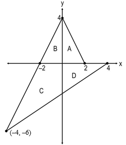

- A. 0
- B. 1
- C. 2
- D. 3
- E. 4

### 9.

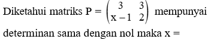

- A. 1.
- B. 2.
- C. 3.
- D. 4.
- E. 5.

### 10.

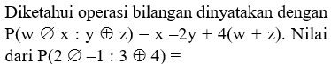

- A. 14.
- B. 15.
- C. 16.
- D. 17.
- E. 20.

### 11.

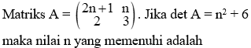

- A. n = -2.
- B. n = -1.
- C. n = 0.
- D. n = 1.
- E. n = 2.

### 12.

**Soal:** Perhatikan beberapa bangun berikut!(1)   Persegi(2)   Segienam beraturan(3)   Segitiga sama sisi(4)   Trapesium sama kakiBanyak bangun yang memiliki 2 simetri putar dan 2 simetri lipat adalah

- A. 0.
- B. 1.
- C. 2.
- D. 3.
- E. 4.

### 13.

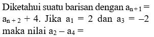

- A. -8
- B. -6
- C. 6
- D. 8
- E. 10

### 14.

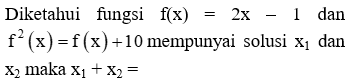

- A. 
- B. 
- C. 
- D. 
- E. 2.

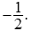
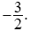
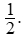
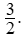
### 15.

**Soal:** Jika 15 orang pekerja dapat menyelesaikan suatu proyek dalam waktu 12 minggu, sebelum pekerjaan dimulai ada 5 pekerja mengundurkan diri maka proyek tersebut dapat diselesaikan dalam waktu ... minggu.

- A. 16
- B. 18
- C. 20
- D. 21
- E. 22

### 16.

**Soal:** Diketahui 900 siswa suatu sekolah dilakukan pendataan. Banyak siswa yang gemar olahraga renang ada sebanyak 450 orang, 600 orang gemar olahraga futsal. Jika x adalah nilai minimum banyak siswa yang gemar kedua olahraga tersebut dan y adalah nilai maksimum banyak siswa yang gemar keduanya maka x + y =

- A. 150.
- B. 450.
- C. 500.
- D. 600.
- E. 650.

### 17.

**Soal:** Anto membeli 10 buah yang terdiri dari buah mangga dan buah apel seharga Rp53.000,00. Jika harga 1 buah apel dan harga 1 buah mangga berturut-turut adalah Rp6.000,00 dan Rp5.000,00 maka banyaknya buah mangga yang dibeli Anto adalah

- A. 5 buah.
- B. 6 buah.
- C. 7 buah.
- D. 8 buah.
- E. 9 buah.

### 18.

**Soal:** Diketahui data 2, 2, 4, 4, 4, 7, 7, 7, 10, 11, 19. Jika salah satu angka diganti dengan x maka rata-ratanya menjadi 3 kali mediannya. Manakah hubungan yang benar antara P dan Q berdasarkan informasi yang diberikan?

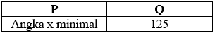

- A. P < Q.
- B. P > Q.
- C. P = Q.
- D. Informasi yang diberikan tidak cukup untuk memutuskan salah satu pilihan di atas.

### 19.

**Soal:** Ada 1000 orang petani disuatu desa. Sebanyak 400 orang menanam pohon mangga, sedangkan 800 orang menanam pohon jambu. Jika x adalah jumlah minimum petani yang menanam keduanya, y adalah jumlah maksimum petani yang menanam keduanya maka selisih x dan y adalah

- A. 200.
- B. 400.
- C. 600.
- D. 800.
- E. 1.000.

### 20.

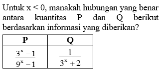

- A. P > Q.
- B. P < Q.
- C. P = Q.
- D. Informasi yang diberikan tidak cukup untuk memutuskan salah satu dari tiga pilihan di atas.

