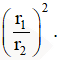

### 1.

**Question:** Toko ponsel “ZAMZUNG” sedang melaksanakan promosi. Jika konsumen membeli di atas 2 juta rupiah, maka konsumen mendapatkan diskon sebesar 20%. Jika harga sebuah HP di atas 3 juta rupiah, maka konsumen mendapat tambahan diskon 10%.Toko “ZAMZUNG” juga mengeluarkan voucher sebesar Rp50.000,00 yang bisa digunakan untuk pembelian HP jenis apapun. Voucher diberlakukan setelah perhitungan diskon-diskon yang berlaku.

**Soal:** Yana membeli 2 buah HP di toko “ZAMZUNG”. HP yang pertama Rp1.950.000,00 dan HP yang kedua Rp2.250.000,00. Yana juga menggunakan 3 buah vouchertoko “ZAMZUNG”. Harga yang akan dibayarkan oleh Yana dengan pembelian 2 HP tersebut adalah

- A. Rp4.200.000,00.
- B. Rp3.510.000,00.
- C. Rp3.460.000,00.
- D. Rp3.360.000,00.
- E. Rp3.210.000,00.

### 2.

**Question:** Toko ponsel “ZAMZUNG” sedang melaksanakan promosi. Jika konsumen membeli di atas 2 juta rupiah, maka konsumen mendapatkan diskon sebesar 20%. Jika harga sebuah HP di atas 3 juta rupiah, maka konsumen mendapat tambahan diskon 10%.Toko “ZAMZUNG” juga mengeluarkan voucher sebesar Rp50.000,00 yang bisa digunakan untuk pembelian HP jenis apapun. Voucher diberlakukan setelah perhitungan diskon-diskon yang berlaku.

**Soal:** Budi membeli HP tipe Z007 seharga Rp3.500.000,00 di toko “ZAMZUNG”. Budi harus membayar sebesar

- A. Rp2.800.000,00.
- B. Rp2.520.000,00.
- C. Rp2.500.000,00.
- D. Rp2.420.000,00.
- E. Rp2.320.000,00.

### 3.

**Question:** Kebun binatang Linkin Zoo dapat dikunjungi oleh warga kota Zingi dan sekitarnya.  Data pengunjung dan harga tiket pada hari kunjungan favorit warga adalah sebagai berikut.Pada setiap hari kunjungan favorit di Linkin Zoo terdata bahwa 50% adalah pengunjung dewasa.Pengelola Linkin Zoo memberi kategori rombongan untuk pengunjung lebih dari 4 orang dalam satu kelompok, dan memberikan promosi harga seperti pada alur berikut

**Soal:** Total harga tiket Linkin Zoo untuk 1 rombongan yang terdiri dari 5 dewasa, 2 balita, 3 lansia, dan 3 anak usia 5—16 tahun adalah

- A. Rp1.150.000,00.
- B. Rp1.250.000,00.
- C. Rp1.350.000,00.
- D. Rp1.450.000,00.
- E. Rp1.550.000,00.

### 4.

**Question:** Kebun binatang Linkin Zoo dapat dikunjungi oleh warga kota Zingi dan sekitarnya.  Data pengunjung dan harga tiket pada hari kunjungan favorit warga adalah sebagai berikut.Pada setiap hari kunjungan favorit di Linkin Zoo terdata bahwa 50% adalah pengunjung dewasa.Pengelola Linkin Zoo memberi kategori rombongan untuk pengunjung lebih dari 4 orang dalam satu kelompok, dan memberikan promosi harga seperti pada alur berikut

**Soal:** Pada hari Jumat terdapat 40 rombongan dengan setiap rombongan terdiri dari ayah, ibu, 2 anak remaja dan  1 balita sedangkan pengunjung selain rombongan adalah kategori dewasa dan anak usia 5—16 tahun. Pendapatan Linkin Zoo hari Jumat adalah

- A. Rp61.080.000,00.
- B. Rp62.080.000,00.
- C. Rp63.080.000,00.
- D. Rp64.080.000,00.
- E. Rp65.080.000,00.

### 5.

**Question:** Kebun binatang Linkin Zoo dapat dikunjungi oleh warga kota Zingi dan sekitarnya.  Data pengunjung dan harga tiket pada hari kunjungan favorit warga adalah sebagai berikut.Pada setiap hari kunjungan favorit di Linkin Zoo terdata bahwa 50% adalah pengunjung dewasa.Pengelola Linkin Zoo memberi kategori rombongan untuk pengunjung lebih dari 4 orang dalam satu kelompok, dan memberikan promosi harga seperti pada alur berikut

**Soal:** Dua keluarga mengunjungi Linkin Zoo bersama-sama dan memutuskan untuk membentuk satu rombongan. Keluarga pertama terdiri dari ayah, ibu, 3 anak usia 5—16 tahun, dan 1 lansia. Sedangkan keluarga kedua terdiri dari ayah, ibu, 2 balita, dan 2 anak usia 5—16 tahun. Potongan harga yang diperoleh rombongan tersebut adalah

- A. Rp160.000,00.
- B. Rp161.000,00.
- C. Rp162.000,00.
- D. Rp163.000,00.
- E. Rp164.000,00.

### 6.

- A. 
- B. 
- C. 
- D. 
- E. 

### 7.

**Soal:** Di dalam tenda akan ditempatkan kursi-kursi dengan ukuran yang sama. Jarak antar kursi pada sebuah baris adalah 0,25 m dan jarak kursi ke dinding tenda 1 m dengan ukuran kursi 0,4 m x 0,4 m. Jika lebar lapangan 18 m, maka banyaknya kursi pada 1 baris adalah ... buah.

- A. 21
- B. 22
- C. 23
- D. 24
- E. 25

### 8.

**Soal:** Jika pada 1 baris terdapat 35 kursi maka lebar yang mungkin dari lapangan adalah ... m.

- A. 24
- B. 24,5
- C. 25
- D. 25,5
- E. 26

### 9.

**Soal:** Jika lebar tenda adalah 9 m, maka luas atap tenda yang mungkin adalah

- A. 200 m2.
- B. 205 m2.
- C. 210 m2.
- D. 215 m2.
- E. 220 m2.

### 10.

**Question:** Adang, Beben, dan Cinta medapatkan tugas pengetikan coding untuk suatu program. Pada minggu pertama mereka dapat menyelesaikan coding sebanyak 1.000 baris. Karena ada kesibukan lain, pada minggu kedua Adang hanya bisa mengerjakan 80%, Beben hanya mengerjakan 50%, dan Cinta hanya mengerjakan 30% sehingga mereka hanya mengerjakan 500 baris.

**Soal:** Jika pada minggu kesatu perbandingan banyak baris coding yang diketik Beben dan Cinta adalah 5 : 3 maka pada minggu kedua Beban mengetik coding sebanyak ... baris.

- A. 90
- B. 100
- C. 250
- D. 300
- E. 400

### 11.

**Question:** Adang, Beben, dan Cinta medapatkan tugas pengetikan coding untuk suatu program. Pada minggu pertama mereka dapat menyelesaikan coding sebanyak 1.000 baris. Karena ada kesibukan lain, pada minggu kedua Adang hanya bisa mengerjakan 80%, Beben hanya mengerjakan 50%, dan Cinta hanya mengerjakan 30% sehingga mereka hanya mengerjakan 500 baris.

**Soal:** Jika pada minggu ketiga perbandingan banyak coding yang diketik Beben dengan  Cinta adalah x : 3y dan Adang sakit sehingga tidak bisa bekerja maka hubungan Cinta mengetik coding sebanyak ... baris.

- A. 
- B. 
- C. 
- D. 
- E. 

### 12.

**Soal:** Tangki 1 berbentuk slinder dengan tinggi h1 dan panjang jari-jari r1. Tangki 2 berbentuk slinder dengan tinggi h2 dan panjang jari-jari r2. Dua tangki tersebut   terisi penuh air dan kran dibuka. Jika laju keluaran air sama dan waktu yang diperlukan untuk mengosongkan tangki sama maka h1 : h2 adalah

- A. 
- B. 
- C. 
- D. 
- E. 

### 13.

**Soal:** Tangki 1 dan tangki 2 berbentuk slinder dengan perbandingan tinggi h1 : h2 adalah  3 : 2,  luas alasnya sama, dan laju  keluaran air sama. Jika kedua tangki terisi penuh air maka perbandingan waktu untuk mengosongkan tangki adalah

- A. 
- B. 
- C. 
- D. 
- E. 

### 14.

**Question:** Sebuah sepeda anak memiliki tiga roda seperti gambar di bawah. Jari-jari roda belakang bagian kiri dan kanan sama, sedangkan perbandingan jari-jari roda depan dan belakang adalah 4 : 3. Waktu yang dibutuhkan untuk sekali mengayuh sepeda adalah 2 detik.

**Soal:** Perbandingan kecepatan roda depan dengan roda belakang adalah

- A. 4 : 1.
- B. 4 : 2.
- C. 4 : 3.
- D. 3 : 1.
- E. 1 : 1.

### 15.

**Question:** Sebuah sepeda anak memiliki tiga roda seperti gambar di bawah. Jari-jari roda belakang bagian kiri dan kanan sama, sedangkan perbandingan jari-jari roda depan dan belakang adalah 4 : 3. Waktu yang dibutuhkan untuk sekali mengayuh sepeda adalah 2 detik.

**Soal:** Banyak kayuhan yang dibutuhkan agar posisi titik P dan Q kembali ke posisi semula untuk kedua kalinya adalah

- A. 1
- B. 2
- C. 3
- D. 4
- E. 5

### 16.

**Question:** Sebuah sepeda anak memiliki tiga roda seperti gambar di bawah. Jari-jari roda belakang bagian kiri dan kanan sama, sedangkan perbandingan jari-jari roda depan dan belakang adalah 4 : 3. Waktu yang dibutuhkan untuk sekali mengayuh sepeda adalah 2 detik.

**Soal:** Waktu minimum yang dibutuhkan agar posisi titik P dan Q kembali ke posisi semula untuk kedua kalinya adalah ... detik.

- A. 4
- B. 6
- C. 8
- D. 10
- E. 12

### 17.

**Question:** Terdapat 10 toko yang menjual buku jenis yang sama dengan rata-rata penjualan pada tahun 2021 adalah 90.000 buku. Pada tahun 2022 naik sebesar 5.000.

**Soal:** Toko dengan kenaikan penjualan tertinggi adalah

- A. A
- B. B
- C. ​C
- D. D
- E. E

### 18.

**Question:** Terdapat 10 toko yang menjual buku jenis yang sama dengan rata-rata penjualan pada tahun 2021 adalah 90.000 buku. Pada tahun 2022 naik sebesar 5.000.

**Soal:** Rata-rata penjualan buku pada 5 toko lain tahun 2022 adalah

- A. 12.500.
- B. 13.000.
- C. 13.500.
- D. 14.000.
- E. 14.500.

### 19.

**Question:** Terdapat 10 toko yang menjual buku jenis yang sama dengan rata-rata penjualan pada tahun 2021 adalah 90.000 buku. Pada tahun 2022 naik sebesar 5.000.

**Soal:** Jika pada tahun 2023 penjulan buku di toko C, D, dan E mengalami kenaikan berturut-turut 10%, 20%, 30%. Toko dengan kenaikan tertinggi dibanding tahun 2021 adalah

- A. A
- B. B
- C. C
- D. D
- E. E

